# LJZ-COFFEE — 微缩模型×咖啡节=城市品牌叙事的物质化革命
---
id: LJZ-COFFEE
name: 陆家嘴咖啡文化节十周年宣传片 / Lujiazui Coffee Festival 10th Anniversary
type: commercial
year: '2025'
director: —（陆家嘴咖啡文化节组委会委托制作）
primary_scene: studio-ad
secondary_scene: custom
tags:
  - 微缩模型
  - 移轴摄影
  - 咖啡城市
  - 地标艺术
  - 庆典叙事
techniques:
  narrative:
    - 微缩城市叙事
    - 地标符号化
    - 品牌庆典叙事
    - 逐镜元素递增
  cinematography:
    - 微缩俯拍移轴
    - 固定细节凝视
    - 跟拍微缩运动体
    - 微距浅景深
    - 多角度地标展示
  color:
    - 暖色调情感霸权
    - 咖啡色谱体系
    - 微缩材质还原
    - 地标色保留+主题色注入
  vfx:
    - 液体合成+微缩融合
    - 咖啡豆粒子散落
    - 蒸汽烟雾微缩匹配
    - 庆典粒子系统
  sound:
    - 器具拟音驱动节奏
    - 城市环境音微缩化
    - 庆典音效层次
    - 无旁白品牌声音
  creative:
    - 城市即品牌载体
    - 微缩模型传播力
    - 地标情感绑定
    - 庆典仪式感构建
styles: [colorful, dreamy, heartwarming, playful, surreal]
scene_relations:
  extra_strong: []
  extra_reference: []
---

## 元信息

| 字段 | 值 |
|------|-----|
| ID | LJZ-COFFEE |
| 名称 | 陆家嘴咖啡文化节十周年宣传片 / Lujiazui Coffee Festival 10th Anniversary |
| 类型 | commercial |
| 年份 | 2025 |
| 导演/工作室 | —（陆家嘴咖啡文化节组委会委托制作） |
| 摄影师 | — |
| 时长 | 0:37 |
| 品牌/客户 | 陆家嘴咖啡文化节 / LUJIAZUI COFFEE FESTIVAL (EST. 2016) |
| 关键词 | 微缩模型, 移轴摄影, 咖啡城市, 地标艺术, 庆典叙事 |
| 主场景 | studio-ad |
| 辅场景 | custom |
| 观看链接 | 本地视频文件: `C:\Users\钱多多\Desktop\微缩模型艺术视频.mp4` |
| 国内备选 | 微博/小红书搜索「陆家嘴咖啡文化节 微缩 宣传片」 |

---

## 技法标签

- **叙事**：微缩城市叙事, 地标符号化, 品牌庆典叙事, 逐镜元素递增
- **镜头**：微缩俯拍移轴, 固定细节凝视, 跟拍微缩运动体, 微距浅景深, 多角度地标展示
- **色彩**：暖色调情感霸权, 咖啡色谱体系, 微缩材质还原, 地标色保留+主题色注入
- **特效**：液体合成+微缩融合, 咖啡豆粒子散落, 蒸汽烟雾微缩匹配, 庆典粒子系统
- **声音**：器具拟音驱动节奏, 城市环境音微缩化, 庆典音效层次, 无旁白品牌声音
- **创意策略**：城市即品牌载体, 微缩模型传播力, 地标情感绑定, 庆典仪式感构建

---

## 叙事技法（→ Writer）

### 微缩城市叙事

- **表现**：将上海陆家嘴真实地标（东方明珠、迪士尼城堡、陆家嘴天桥、中国馆）以 1:100-1:200 微缩模型重建，每一处地标被咖啡主题元素改造——黄浦江上的咖啡豆轮船、天桥中心的压粉器、中国馆漏咖啡豆——城市变成一座可触摸的咖啡童话。
- **手法**：利用观众对真实地标的熟悉度建立信任基线，再通过超现实改造制造「识别→惊讶→愉悦」的递进心理反应。每个场景都是一个微型世界观，14 个场景并列推进，不依赖因果链。
- **可迁移**：城市品牌/旅游宣传/节庆活动可通过微缩化熟悉的城市肌理来创造「既熟悉又陌生」的观感。先建立地标可识别性，再注入品牌元素。比例尺可根据场景需要灵活调整（全景 1:200，特写 1:50）。
- **适用场景**：studio-ad, 城市品牌, 旅游推广, 节庆宣传

### 地标符号化

- **表现**：东方明珠、上海中心、外滩建筑群、迪士尼城堡、中国馆、陆家嘴环形天桥——每个地标出现 1-3 次，每次从不同角度（俯拍/平视/仰拍）展示，且永远伴随一个咖啡改造：东方明珠旁有咖啡豆轮船（00:00）、中国馆装满漏出的咖啡豆（00:15）、迪士尼城堡连接咖啡机手柄（00:20）。
- **手法**：地标不是背景板而是叙事载体。每个地标承担一个「咖啡动词」——轮船=运输、中国馆=储存、天桥=制作、城堡=萃取。通过功能置换让地标从「被观看的景观」变为「参与叙事的角色」。
- **可迁移**：任何以特定城市/地点为背景的品牌内容——挑选 3-5 个可识别度最高的地标，为每个分配一个品牌功能/动词，用地标的符号力为品牌赋能。
- **适用场景**：城市品牌联名, 地标营销, 旅游产品

### 品牌庆典叙事

- **表现**：从清晨黄浦江上的咖啡豆轮船启航（00:00），穿越城市的 12 个咖啡奇观场景，到日落时分的陆家嘴全景（00:24），最终抵达庆典广场的 10 周年蛋糕+烟花（00:28），构成一次「一日旅程」的庆典弧线。结尾白底红字 Logo 揭示主题。
- **手法**：用一天的时间线包裹并列场景，赋予非线性镜头以情绪递进——探索→惊奇→温暖→欢庆。飞艇上的"10th Anniversary"（00:28）和 Logo 上的"EST. 2016"形成时间锚点，让 37 秒承载十年叙事。
- **可迁移**：周年/庆典类项目——将并列创意场景装入一个时间框架（一天/四季/十年），用日出→日落或过去→未来的结构赋予散点镜头以史诗感。
- **适用场景**：品牌周年庆, 节庆营销, 里程碑传播

### 逐镜元素递增

- **表现**：14 个镜头中，咖啡元素从少到多、从简到繁逐步升级：镜头 1-3 只有咖啡豆轮船+喝咖啡的小人 → 镜头 4-6 牛奶搅拌器+摩卡壶+巧克力酱冰淇淋 → 镜头 7-9 咖啡杯巴士+咖啡豆建筑+压粉器天桥 → 镜头 10-12 咖啡机城堡+拉花喷泉 → 镜头 13 庆典蛋糕+烟花（咖啡元素退居二线，庆祝成为主角）。
- **手法**：每 3-4 个镜头升级一次复杂度，避免信息过载。初期建立世界观规则（城市被咖啡化），中期推向荒诞极致，末期将注意力从咖啡转向品牌庆典本身。
- **可迁移**：任何需要展示「品牌改造世界」概念的创意——从轻到重、从合理到荒诞地递增改造程度，让观众逐步接受并期待下一个更大胆的创意。
- **适用场景**：世界构建型广告, 品牌世界观传播

---

## 镜头语言（→ DP）

### 微缩俯拍移轴

- **表现**：开场镜头（00:00）以高角度俯瞰微缩黄浦江全景，左侧陆家嘴建筑群、右侧外滩万国建筑，江面上一艘咖啡豆轮船——景深极浅，画面上下两端虚化，只有中段江面和轮船锐利。
- **技术参数**：预估俯拍角度 60-75°，镜头高度约 50-80cm（相对 1:150 比例模型），中长焦微距镜头（等效 100mm+），光圈 f/2.8-4 实现移轴式浅景深。灯光为柔和漫射模拟清晨薄雾。
- **可迁移**：拍摄微缩场景全景时，用 45-75° 俯角 + 中长焦 + 大光圈产生移轴效果，让真实模型看起来像是从极高处拍摄的真实城市。关键是景深只覆盖画面中段 30-40%，上下虚化。
- **适用场景**：微缩模型拍摄, 城市鸟瞰模拟, 世界观建立镜头

### 固定细节凝视

- **表现**：镜头 5（00:07）欧式街道中的银色摩卡壶、镜头 8（00:15）中国馆漏咖啡豆、镜头 9（00:17）环形天桥压粉器——全部固定机位，无推拉摇移，让观众的眼睛自由探索微缩细节。
- **技术参数**：三脚架固定，镜头垂直于被摄主体中轴，景深覆盖主体全貌（f/5.6-8），灯光采用 45° 侧光突出微缩模型的立体感和材质纹理。每个固定镜头保持 2-4 秒——足够观众识别主体+发现细节。
- **可迁移**：当微缩模型足够精美时，固定镜头比运动镜头更有力量——它传达「这个世界的细节值得你仔细看」的信号。每个固定镜头至少 2 秒，用侧光而非顺光突出纹理。
- **适用场景**：精致产品展示, 微缩模型, 细节驱动的品牌内容

### 跟拍微缩运动体

- **表现**：镜头 7（00:12）红色咖啡杯巴士从左向右行驶穿过城市街道——摄影机跟随巴士平移，保持巴士在画面中心位置不变，背景建筑流动而过。车窗内可见喝咖啡的小人。
- **技术参数**：轨道或滑轨平移，速度与巴士移动同步（约 5-10cm/s 在 1:150 比例下），中焦段（50-70mm 等效），光圈 f/4-5.6 确保巴士全锐+背景适度虚化。
- **可迁移**：为微缩世界注入「生命感」的关键——一个运动的主体（车/船/人）让静态模型被感知为活的世界。运动方向平行于镜头平面（左→右或右→左）最容易匹配速度。
- **适用场景**：微缩世界活化, 城市生活模拟, 品牌旅程叙事

### 多角度地标展示

- **表现**：东方明珠出现 3 次：00:00 左侧俯拍远景、00:18 背景天际线、00:24 日落全景偏左位置。每次的角度和光线都不同，从晨光→白天→金色日落，让同一地标随时间推进产生情感变化。
- **技术参数**：三次出现的景别依次为远景(包括全城)→中景(建筑群)→全景(日落逆光)。灯光设置为 5000K(晨光)→5600K(白天)→3200K(日落暖光)，色温递降增强时间流逝感。
- **可迁移**：在短片/广告中让核心地标/产品多次出现，每次变换角度+景别+光线，用重复曝光建立记忆点，用变化传递时间/情绪推进。
- **适用场景**：地标营销, 产品植入, 品牌视觉锤

### 微距浅景深特写

- **表现**：镜头 3（00:04）草坪上喝咖啡的微缩小人、镜头 6（00:09）巧克力酱淋下——极浅景深让前景的微缩人物/液体锐利而背景完全虚化，强化了模型的精细度和物性。
- **技术参数**：微距镜头（1:1 到 1:2 放大比），光圈 f/1.8-2.8，拍摄距离 10-30cm。对焦点精确放在主要叙事元素上（小人手中的咖啡杯/巧克力酱流下的尖端）。灯光为柔光箱从 45° 角补光，避免阴影吃掉细节。
- **可迁移**：在需要让观众「陷入」微缩世界的镜头中，用极浅景深模仿人眼贴近观察小物体时的自然视觉——这正是微缩模型魅力的核心：越近越真实。
- **适用场景**：微缩模型特写, 产品细节, 食品广告

---

## 色彩/美术（→ Art Director）

| 场景/段落 | 主色 (hex) | 辅色 (hex) | 情绪 | 设计理由 |
|-----------|-----------|-----------|------|---------|
| 黄浦江晨光 (00:00) | `#D4A574` 暖金棕 | `#F5E6D3` 奶油白 | 宁静、启程 | 将黄浦江染成咖啡色，建立「这是一座咖啡之城」的世界观 |
| 绿地公园 (00:01-05) | `#FFB7C5` 樱花粉 | `#90C695` 草绿 | 生机、春日 | 粉色呼应咖啡节视觉系统，绿色为暖色海洋提供呼吸 |
| 城市街道 (00:05-08) | `#C4956A` 建筑暖灰 | `#8B6B4A` 咖啡棕 | 探索、惊喜 | 建筑保留原色、咖啡元素注入深棕——地标可识别性优先 |
| 巧克力冰淇淋 (00:09) | `#5C3317` 深巧克力 | `#F5F5F0` 奶白 | 甜蜜、诱惑 | 最深色的场景，用食物欲望色创造视觉高潮前的小高峰 |
| 中国馆+咖啡豆 (00:15) | `#C41E3A` 中国红 | `#3E1F0D` 咖啡豆深棕 | 文化认同、幽默 | 保留地标标志色的同时用咖啡色改造内容物——辨识度+创意 |
| 迪士尼城堡 (00:20) | `#F4C2C2` 童话粉 | `#7B9E6D` 森林绿 | 奇幻、童趣 | 城堡本色+咖啡机手柄的金属色( #C0C0C0 )形成材质对比 |
| 拉花喷泉 (00:22) | `#6F4E37` 浓缩咖啡 | `#FEFDFA` 奶泡白 | 优雅、技艺 | 咖啡拉花的经典双色直接搬进城市喷泉——最高纯度的品牌色 |
| 日落全景 (00:24-27) | `#E8A84C` 日落金 | `#D4785C` 暖橙粉 | 温暖、感动 | 全片暖色最高潮，金色逆光统一所有建筑——咖啡=温暖=归属 |
| 庆典广场 (00:28) | `#E31E24` 庆典红 | `#FFD700` 金色烟花 | 欢庆、高潮 | 从咖啡色系跳出，用纯红金建立「这是庆典时刻」的信号 |
| Logo 结尾 (00:32) | `#FFFFFF` 纯白 | `#E31E24` 品牌红 | 确认、记忆 | 全片唯一纯白背景——视觉清零+品牌强烙印 |

### 暖色调情感霸权

- **表现**：全片 37 秒中约 90% 画面为暖色调——棕、金、粉、红、橙占主导。冷色仅出现在零星蓝天（00:01 天际线）和绿色植被（00:04 公园草坪，但绿也被暖光染色）。色调设计让观众全程处于「被咖啡温暖包裹」的感官体验中。
- **可迁移**：当品牌核心情感是「温暖/治愈/归属」时，可大胆采用 85-95% 暖色调比例。冷色只作为呼吸点出现（总量 <15%），且让冷色也被全局暖光轻微染色以保持统一。
- **适用场景**：食品饮料广告, 节日营销, 生活方式品牌

### 咖啡色谱体系

- **表现**：从浅奶油（`#F5E6D3`）→ 拿铁棕（`#D4A574`）→ 浓缩咖啡（`#6F4E37`）→ 深烘黑（`#3E1F0D`），四种咖啡烘焙度对应场景的情绪浓度：越深 = 越强烈的情感/越核心的品牌信息。
- **可迁移**：任何单一品类（咖啡/茶/巧克力/红酒）都可以建立类似「浓度→情绪」的色谱梯度，让颜色本身成为隐性叙事。
- **适用场景**：品类品牌视觉系统, 包装设计灵感, 品牌色延展

### 微缩材质还原

- **表现**：建筑的混凝土粗糙感（`#B0A89C`）、玻璃幕墙的反光高光（`#D6E4F0` 带冷蓝）、樱花树的纸质花瓣纹理、咖啡豆的油光高光——所有微缩材料的表面质感被精确还原和强调。
- **可迁移**：微缩模型拍摄时，材质还原度决定「真实感」的成败。使用侧光+柔光箱组合（比例约 3:1）突出纹理，避免顺光扁平化。树脂和 3D 打印件需消光处理以避免塑料反光暴露比例。
- **适用场景**：微缩场景, 产品质感展示, 材质驱动的内容

### 地标色保留+主题色注入

- **表现**：东方明珠的银灰色（`#C8CCD0`）、中国馆的正红色（`#C41E3A`）、迪士尼城堡的粉色（`#F4C2C2`）——所有地标的标志色被忠实保留，咖啡主题色（棕/金/奶油）通过改造物体（咖啡豆/牛奶/摩卡壶）注入场景，而非覆盖地标本色。
- **可迁移**：与知名 IP/地标合作的品牌内容——永远保留 IP 的颜色识别度，把你的品牌色放在「改造物」上而非「被改造物」上。这既尊重 IP 又清晰传递品牌信息。
- **适用场景**：城市联名, IP 合作, 地标营销

---

## 特效语言（→ VFX）

### 液体合成+微缩融合

- **表现**：镜头 4 牛奶搅拌器注入牛奶（00:05）、镜头 6 巧克力酱淋下（00:09）、镜头 11 拉花喷泉（00:22）——真实液体素材（可能是实拍牛奶/咖啡倾倒）通过跟踪+合成无缝嵌入微缩场景。液体与微缩模型的接触点（滴落、飞溅、表面张力）被精确匹配。
- **实现思路**：先拍摄微缩场景的 clean plate，再实拍液体倾倒（在绿幕前或可控环境），通过 3D 跟踪将液体匹配到场景透视。关键难点：液体在微缩尺度下的表面张力表现与真实尺度不同——需要调整流体的重力参数或选择合适粘度的替代液体（如甘油调稠度）。
- **可迁移**：微缩+实拍液体合成时，用比真实液体略稠的替代品（甘油+水或糖浆）拍摄，使其在微缩尺度下看起来行为「正确」。跟踪点放在场景的固定建筑元素上。
- **适用场景**：微缩模型+动态元素, 食品饮料广告, 数字合成

### 咖啡豆物理散落模拟

- **表现**：镜头 8（00:15）中国馆建筑顶部装满咖啡豆，豆子从底部开口散落——咖啡豆遵循重力下落、弹跳、堆积的物理规律，与微缩场景的材质（木地板/草地）发生正确的碰撞反应。
- **实现思路**：3D 粒子模拟（Houdini/Blender）——将咖啡豆建模为椭球刚体（~8mm×5mm 真实尺寸，按 1:150 缩放），设置重力+碰撞+摩擦参数。豆子数量约 200-500 粒足够填充 2-3 秒画面。与微缩实拍背景合成时注意阴影匹配。
- **可迁移**：任何需要「小颗粒散落」的微缩场景——关键不是粒子数量而是碰撞行为的真实感。确保前 5-10 粒豆子的弹跳路径清晰可追踪，其余作为视觉填充。
- **适用场景**：产品原料展示, 微缩世界动态, 物理模拟

### 蒸汽烟雾微缩匹配

- **表现**：镜头 5（00:08）摩卡壶蒸汽、镜头 10（00:20）城堡周围的白色蒸汽/烟雾——烟的尺度与微缩场景匹配（蒸汽从壶嘴冒出约 2-3cm 在 1:150 比例下），飘散速度也被调慢以匹配微缩尺度的时间感知。
- **实现思路**：两种可选方案：① 实拍真实的微缩蒸汽（用小比例摩卡壶实际加热，高速摄影后慢放）；② 2D 烟雾素材（ActionVFX 等）缩放+速度调整后合成。本案推测为方案②，因蒸汽的边缘过于柔和均匀。
- **可迁移**：微缩场景加烟雾时，关键是把烟的扩散速度降至真实速度的 1/3-1/5（因微缩尺度下空气动力学感知不同）。同时缩小烟雾的湍流细节避免 scale giveaway。
- **适用场景**：微缩场景氛围, 热饮/食品广告, 城市雾景模拟

### 庆典粒子系统

- **表现**：镜头 13（00:28-32）10 周年蛋糕上方的烟花爆炸、飘落的彩带/纸屑、飞艇缓慢移动——多层粒子系统同时运行，烟花为发射粒子、彩带为重力飘落粒子、飞艇为受控运动体。
- **实现思路**：烟花粒子：放射状发射+重力下落+颜色渐变（金→红→灭），每朵烟花约 50-100 粒子，持续 1-1.5 秒。彩带：扁平长方形刚体+空气阻力+随机旋转+缓落到地面。飞艇：路径动画+轻微偏航摇摆。
- **可迁移**：庆典场景的粒子设计要避免视觉噪音——烟花（高层）+ 彩带（中层）+ 地面元素（蛋糕）形成清晰的三层纵深。粒子颜色必须与品牌色统一。
- **适用场景**：庆典/节日营销, 品牌里程碑, 活动宣传

---

## 声音设计（→ Sound Designer）

### 器具拟音驱动节奏

- **表现**：全片无旁白无对白，节奏完全由咖啡器具的拟音驱动——咖啡豆轮船的汽笛声（00:00）→ 牛奶注入的咕噜声（00:05）→ 摩卡壶蒸汽嘶嘶声（00:08）→ 咖啡豆滚落的清脆碰撞（00:15）→ 压粉器机械砰声（00:18）→ 咖啡机蒸汽喷射（00:21）。每个声音都是下一个场景的预告。
- **声音层次**：拟音（Foley）占 50%、环境音 20%、音乐 30%。无对白层。拟音被推到混音前景，每个器具声清晰可辨如打击乐器。
- **可迁移**：产品相关的广告——把产品使用过程的每一个声音都当作音乐节奏的组成部分。录制时用近场麦克风（10-30cm）捕捉细节质感，混音时给 Foley 多 3-6dB 让它们「跳出」音乐。
- **适用场景**：产品演示, 工艺展示, ASMR 风格广告

### 城市环境音微缩化

- **表现**：背景中的鸟鸣（00:01-03）、远处城市喧嚣（全程低音量）、江水声（00:00）——这些环境音的音量被压低至 -18 到 -24dB，且低频被削减（高通滤波 ~200Hz），模拟从高空/远处听到的城市。
- **声音层次**：环境音全部在远层（-20dB 以下），且做了「微缩化处理」——混响减少、高频保留、低频切除。这种处理让城市声音听起来像从精致的微缩模型中传出。
- **可迁移**：微缩/模型场景的声音设计——把正常的环境音通过高通滤波（150-250Hz）+ 混响衰减处理，创造「小而精致」的听觉感知。对比：正常城市环境音 ~200Hz 以下有大量轰鸣，微缩版应切除这些。
- **适用场景**：微缩场景, 沙盘/模型展示, 俯瞰视角镜头

### 庆典音效层次叠加

- **表现**：镜头 13（00:28-32）——烟花爆炸声（低频 boom + 高频 crackle 双层）、人群欢呼声（中频，多层叠加制造人群感）、彩带飘落声（高频沙沙声）、飞艇引擎低频嗡鸣——四个声音层同时播放但互不遮蔽。
- **声音层次**：每层占据不同频段：烟花低频（50-150Hz）、欢呼中低频（200-800Hz）、飞艇中频（400-2kHz）、彩带高频（2k-8kHz）。频率分离让 4 层声音同时清晰。
- **可迁移**：任何需要「热闹但不嘈杂」的庆典场景——用频率分配法给每个音效层专属频段，最多 4-5 层。如果超过，用侧链压缩让音乐在音效高潮时自动 duck 3-5dB。
- **适用场景**：庆典/节日, 活动高潮, 群体场景

### 无旁白品牌声音设计

- **表现**：全片唯一的「人声」是结尾人群欢呼声（00:29），无任何旁白/解说/对白。品牌信息仅通过视觉文字（标题、Logo、日期）和声音氛围传递。配乐为轻快爵士/香颂风格（钢琴+手风琴+轻打击乐），全程维持休闲咖啡 mood。
- **声音层次**：音乐占主导（约 40-50% 听觉注意力），拟音次之（30-40%），环境音最低（10-20%）。音乐从未被音效打断，两者通过频率和节奏自然融合——器具拟音的节奏与音乐 BPM 匹配。
- **可迁移**：无旁白品牌短片——让音乐成为情感主线，拟音成为节奏点缀。关键：拟音的节奏必须与音乐 BPM 同步（±5BPM 内），否则即使单个声音好听，整体也会感觉「松散」。
- **适用场景**：品牌形象片,  lifestyle 内容, 氛围驱动的广告

---

## 创意策略（→ 广告片专属）

### 城市即品牌载体

- **表现**：陆家嘴咖啡文化节不直接展示咖啡产品/咖啡师/活动现场，而是将整个陆家嘴城市微缩化并用咖啡元素改造——品牌信息通过「城市即咖啡」的隐喻传递。这种方式让一个区域性的咖啡节获得了「定义一座城市」的宏大叙事力。
- **品牌目的**：将「陆家嘴咖啡文化节」从功能性活动（喝咖啡的地方）升级为文化符号（咖啡之城的精神象征）。不做功能说明，只做品牌想象。
- **可迁移**：区域性活动/品牌——将活动举办地微缩化+主题化改造，用「城市即我们」的叙事让活动获得超越其物理规模的文化分量。不需要展示活动本身，展示活动所代表的世界观即可。
- **适用场景**：城市级活动, 区域性品牌, 文化节/音乐节

### 微缩模型传播力

- **表现**：微缩模型天然具有「可分享性」——精致的细节让人想暂停截图、奇特的尺度让人想转发、手工感让人感受到诚意。这与 CGI 广告的「完美塑料感」形成反差，传递出匠心和温度。
- **品牌目的**：在社交媒体时代，微缩模型内容比传统实拍或 CG 广告更容易获得「二次传播」——用户会自发截图、放大、讨论「这个场景是怎么做的」。
- **可迁移**：如果品牌预算有限但追求社交传播——投资微缩模型制作（成本可控，1:100 的单体建筑模型约 ¥2,000-10,000）比投资全 CG 管线更具「传播 ROI」，因为手工感本身就是话题。
- **适用场景**：社交传播优先的品牌内容, 预算敏感型创意, 工艺/手作品牌

### 地标情感绑定

- **表现**：用户在看到东方明珠里飘着咖啡香、迪士尼城堡萃取 espresso 时会心一笑——品牌通过改造他们已有情感连接的地标，将地标的情感资产转移到品牌上。对上海人来说这是「家乡的新模样」，对外地人来说是「上海的另一种打开方式」。
- **品牌目的**：利用地标的高识别度和既有情感，降低新品牌的认知门槛。观众不需要被说服「咖啡节很酷」，他们看着熟悉的城市被咖啡化就已经在愉悦中接受了。
- **可迁移**：城市/地标相关的品牌营销——比起创造全新视觉，不如改造已有视觉。观众对熟悉物的「变形」比对陌生物的「展示」更感兴趣。选择情感浓度最高的 1-2 个地标作为核心改造对象。
- **适用场景**：城市营销, 文旅品牌, 地方特产

### 庆典仪式感构建

- **表现**：从「10.22 WED - 26 SUN」的全程日期条、到「10th Anniversary」飞艇、到结尾蛋糕+烟花+「EST. 2016」Logo——仪式感不是通过宏大叙事而是通过细节的累积：日期=紧迫感、周年=重要性、烟花=庆祝、EST.=传承。
- **品牌目的**：让一个咖啡节的活动推广获得「里程碑事件」的分量。10 周年的信息不是一次喊出而是四次渐进释放（日期条→飞艇→蛋糕→Logo），每次增加情感的重量。
- **可迁移**：周年/里程碑传播——不要一次说「我们 X 周年了」，而是把时间信息拆成 3-5 个触点分散在全片中，每次增加一个维度（日期/年限/传承/未来），让观众在不知不觉中建立品牌的「时间厚度」。
- **适用场景**：品牌周年庆, IPO/上市传播, 品牌升级

---

## 适用提示

- **最佳匹配场景**：城市/地标相关的品牌内容、咖啡/食品/生活方式品类的品牌形象片、微缩模型/手工艺风格的创意项目、周年庆/节庆类传播、需要高社交传播力的短视频内容
- **不适用场景**：需要展示实际产品功能的演示片、严肃/科技感强的 B2B 内容、要求真人出镜的品牌故事、时效性强的促销广告（微缩模型制作周期长）
- **引用优先级**：核心引用（当项目涉及 微缩模型艺术 / 城市品牌叙事 / 地标改造创意 / 暖色调情感设计 / 无旁白品牌短片 时必看此案例）；补充参考（咖啡品类视觉系统 / 庆典仪式感构建 / 社交传播策略）；特定技法借用（微缩俯拍移轴 / 液体合成+微缩融合 / 器具拟音节奏设计）

---

## 参考资源

- 幕后花絮：搜索「陆家嘴咖啡文化节 微缩 幕后」
- 导演访谈：—
- 技术解析文章：搜索「miniature model tilt-shift commercial making of」
- 拉片视频：—
- 相关案例（微缩技法）：HONDA-COG（精密实物链）, SONY-BALLS（实物奇观）, PIPER（微观史诗视角）
- 相关案例（城市叙事）：LOUVRE-MAP（双城蒙太奇）, KOYAANISQATSI（城市延时摄影）
- 相关案例（创意广告）：IKEA-LAMP（物的人类化）, GUINNESS-SURFER（品牌隐喻叙事）

---

## §拉片附录

> **视频源**：微缩模型艺术视频.mp4（37.5s, H.264 1080p）
> **分析日期**：2026-06-18
> **方法**：video_analyze 两遍交叉 + ffmpeg 逐镜头抽帧 + vision_analyze 逐张内容-描述匹配
> **校准状态**：✅ 用户确认时间码 + ✅ 逐帧验证（6/14 处纠正 video_analyze 错误）
> **设计规范**：`references/pull-sheet-implementation.md`

### 镜头序列总览（按场景分组）

> 人工总览用。分镜图内嵌，角色消费走下方分段序列。

#### 场景1: 开场 · 咖啡之城世界观（00:00–05.5）

- **镜头1** `00:00.0–01.5` | 1.5s | 全景 · ★缓推 | 纵深对称构图（两岸向消失点汇聚）
  - 粉色江水#F4C2C2 / 建筑暖灰#C4956A / 晨光漫射5000K
  - 咖啡豆轮船在黄浦江航行，左侧东方明珠，右侧外滩建筑群
  - 音效：轮船汽笛 | 叙事：世界观引入 | 特效：江面波纹
  - 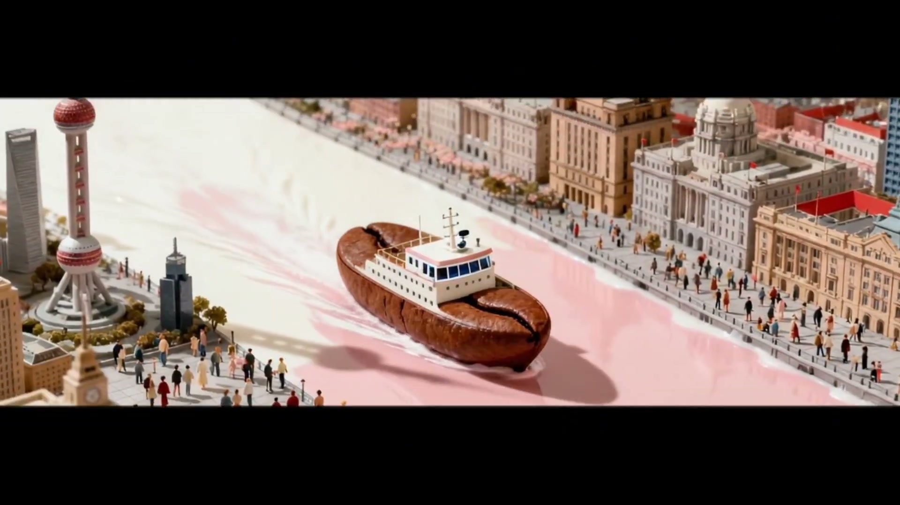
  - > ★ vision_analyze 纠正：透视汇聚线+浅景深确认缓推，非固定机位。无日期条。

- **镜头2** `01.5–05.5` | 4.0s | 全景 · 固定 | 雕塑居中 / 前景圆桌
  - 樱花粉#FFB7C5 / 草绿#90C695 / 日光5600K
  - 陆家嘴中心绿地飞天雕塑、粉樱树、白鸽、微缩小人喝咖啡、主标题「LUJIAZUI COFFEE FESTIVAL」浮现
  - 角色：微缩小人（草坪圆桌喝咖啡） | 音效：鸟鸣（微缩化·高通~200Hz） | 叙事：空间建立+标题曝光 | 特效：白鸽飞行动画
  - 日期条：「10.22 WED – 26 SUN」
  - 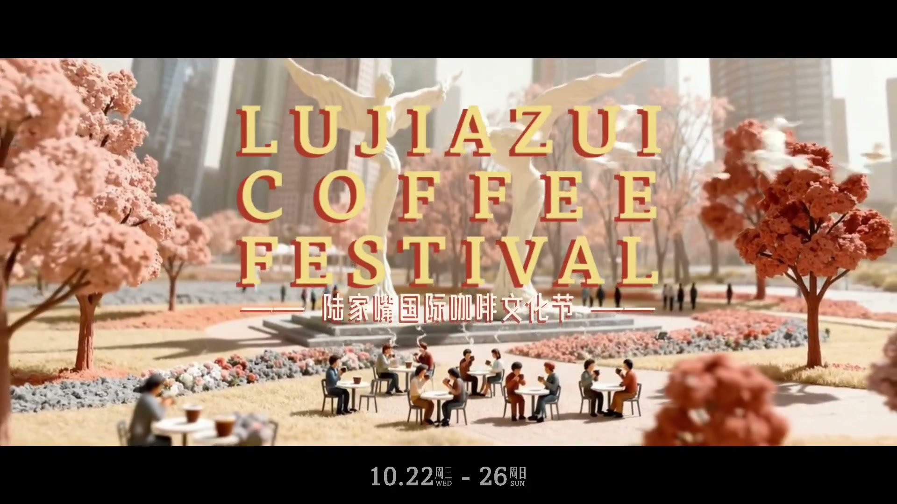

#### 场景2: 创意装置 · 咖啡制作的城市尺度（05.5–11.0）

- **镜头3** `05.5–07.5` | 2.0s | 中景 · 固定 | 球体居中 / 欧式广场（外滩风格建筑群）
  - 奶油白#F5E6D3 / 建筑暖灰 / 侧光45°
  - 球形玻璃装置注入牛奶——东方明珠球体变形
  - 音效：牛奶注入咕噜声 | 叙事：首次咖啡元素注入城市 | 特效：牛奶液体合成（实拍+跟踪）
  - 日期条：有
  - 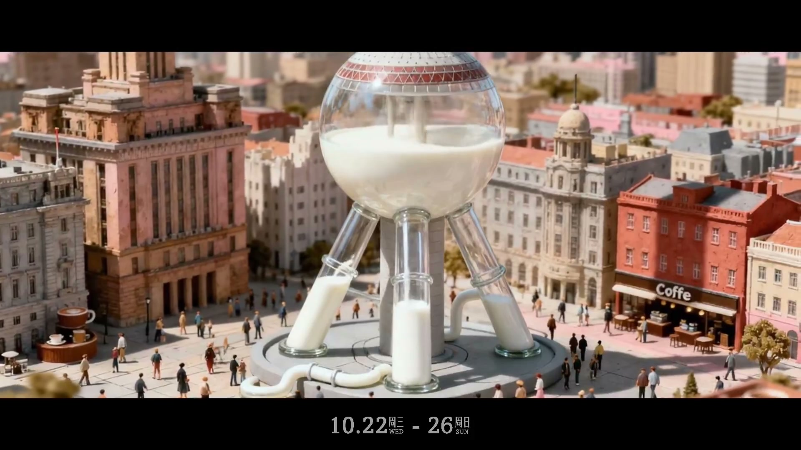

- **镜头4** `07.5–08.5` | 1.0s | 中景 · 固定 | 摩卡壶居中 / Haussmann 欧式街道
  - 摩卡银#C0C0C0 / 建筑米白 / 左上方日光
  - 摩卡壶造型咖啡亭，微缩小人排队点咖啡
  - 角色：微缩小人（排队/广场行走） | 音效：摩卡壶蒸汽嘶嘶声 | 叙事：咖啡器具=城市建筑
  - 日期条：有
  - 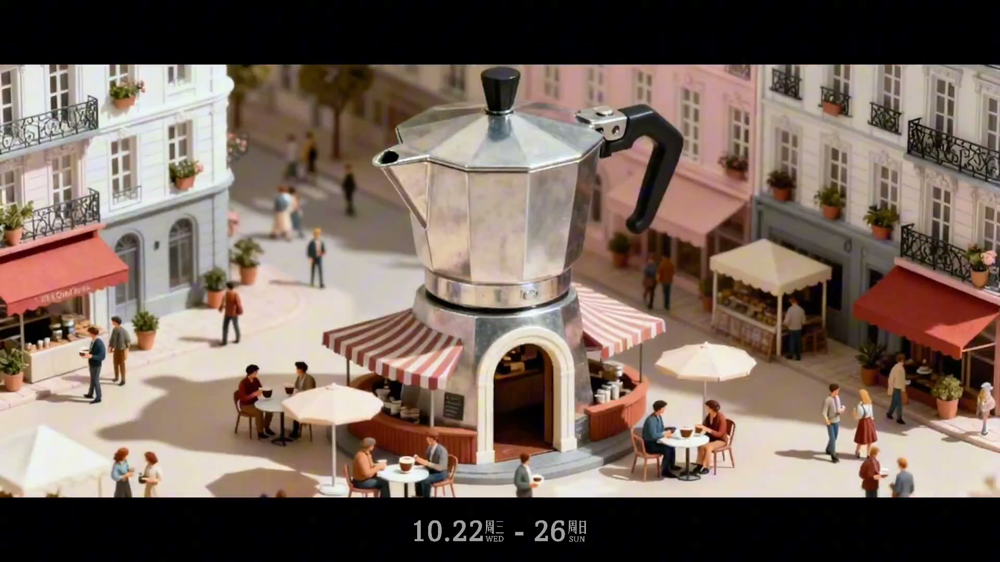

- **镜头5** `08.5–11.0` | 2.5s | 中景 · 固定 | 冰淇淋居中 / ★飞碟形现代建筑背景
  - 深巧克力#5C3317 / 奶白#F5F5F0 / 顶光
  - 巧克力酱淋巨型冰淇淋球
  - 角色：微缩小人（广场活动） | 叙事：食物欲望递进 | 特效：巧克力酱液体合成
  - > ★ vision_analyze 纠正：飞碟形建筑（梅赛德斯-奔驰文化中心风格），非上海大剧院。
  - 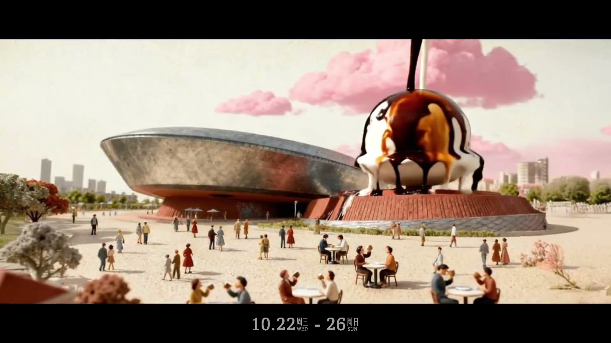

#### 场景3: 城市融合 · 6处地标×咖啡器具（11.0–24.0）

- **镜头6** `11.0–14.0` | 3.0s | 中景 · ★跟拍 | 巴士居中（跟拍锁定） / 欧式街道+樱花树
  - 巴士红#E31E24 / 建筑粉白 / 日光侧光
  - 咖啡杯红色巴士行驶，「lujiazui COFFEE FESTIVAL」车身文字
  - 角色：微缩乘客（车内喝咖啡） | 音效：巴士引擎声 | 叙事：微缩世界「活化」——运动主体注入生命感
  - 日期条：有
  - > ★ vision_analyze 确认跟拍（背景 motion blur）。
  - 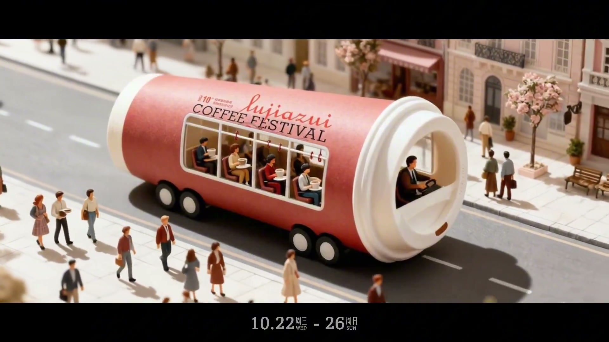

- **镜头7** `14.0–17.0` | 3.0s | 中景 · 固定 | 中国馆居中 / 广场
  - 中国红#C41E3A / 咖啡豆深棕#3E1F0D / 日光侧光45°
  - 中国馆顶部装满咖啡豆，从底部流出堆积
  - 音效：咖啡豆滚落碰撞 | 叙事：地标功能置换（储存→倾倒） | 特效：咖啡豆刚体粒子模拟（~200-500粒）
  - 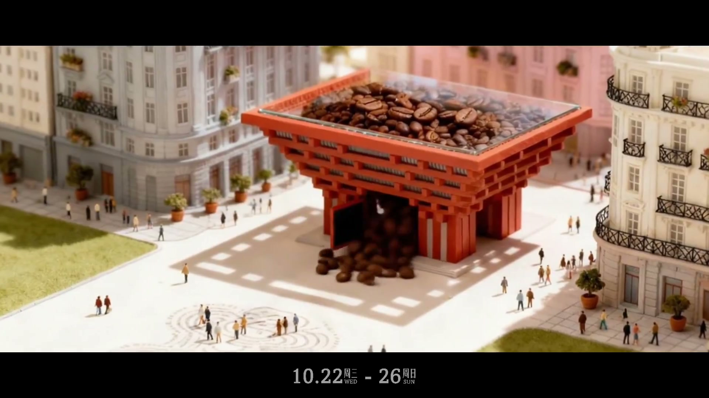

- **镜头8** `17.0–19.5` | 2.5s | 全景 · 固定 | ★粉锤装置居中 / 东方明珠背景
  - 金属银#C8CCD0 / 咖啡粉棕#6F4E37 / 顶光
  - 粉锤（Tamper）形透明圆形建筑，内部小人喝咖啡，咖啡粉铺地
  - 角色：微缩小人（圆形建筑内喝咖啡） | 音效：压粉器机械砰声 | 叙事：器具=建筑（粉锤→透明咖啡厅）
  - > ★ vision_analyze 纠正：独立粉锤装置，非陆家嘴环形天桥。东方明珠在背景远处。
  - 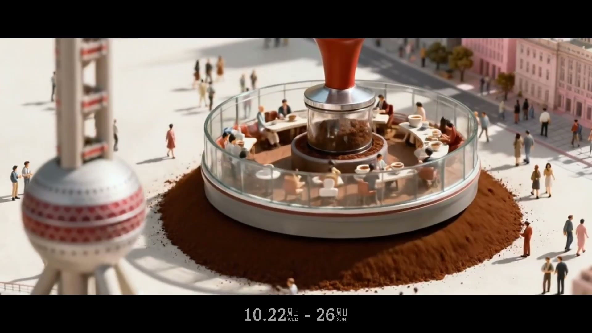

- **镜头9** `19.5–21.0` | 1.5s | 中景 · 固定 | 城堡居中 / 树木环绕
  - 童话粉#F4C2C2 / 森林绿#7B9E6D / 日光漫射
  - 迪士尼睡美人城堡 + 咖啡机手柄（Portafilter），手柄=透明玻璃通道供小人穿行
  - 角色：微缩小人（穿行手柄透明通道） | 音效：咖啡机蒸汽喷射 | 叙事：地标功能置换（城堡→萃取） | 特效：蒸汽烟雾合成（扩散速度1/3-1/5）
  - > ★ vision_analyze 确认：咖啡机手柄（Portafilter），非摩卡壶。
  - 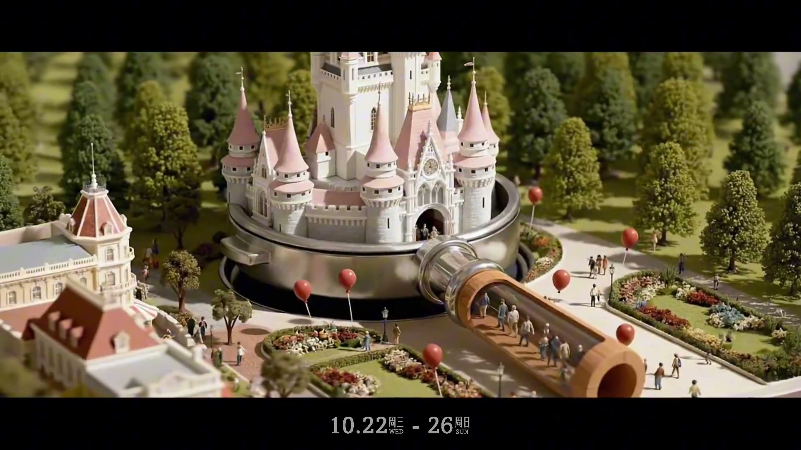

- **镜头10** `21.0–24.0` | 3.0s | 中景 · 固定 | 喷泉居中 / ★白色现代建筑+外滩建筑群背景
  - 浓缩咖啡#6F4E37 / 奶泡白#FEFDFA / 日光
  - 牛奶注入喷泉形成咖啡拉花
  - 角色：微缩小人（广场围观喷泉） | 叙事：咖啡制作最终形态——拉花艺术 | 特效：牛奶拉花动态液体合成
  - > ★ vision_analyze 纠正：白色现代主义立方建筑+外滩建筑群，非上海博物馆。
  - 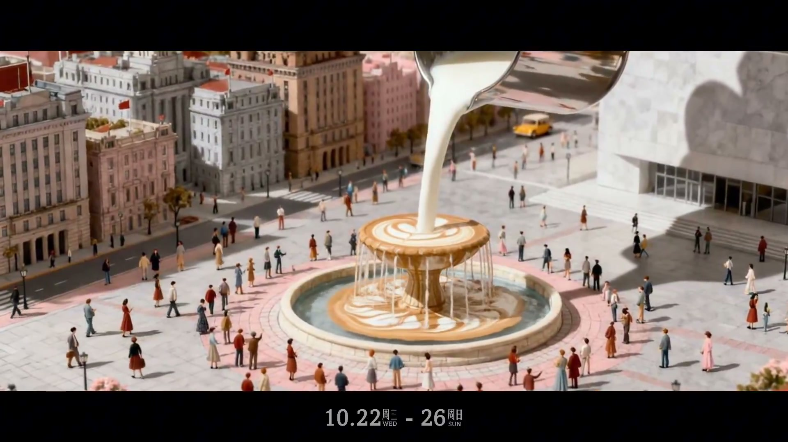

#### 场景4: 日落与庆典（24.0–33.0）

- **镜头11** `24.0–27.5` | 3.5s | 全景 · 固定 | 宽幅天际线 / 两岸对称
  - 日落金#E8A84C / 暖橙粉#D4785C / 金色逆光3200K
  - 日落陆家嘴全景：东方明珠+上海中心+环球金融中心+金茂大厦+外滩。两岸悬挂咖啡杯图案旗帜
  - 叙事：情感收束——全片暖色最高潮 | 特效：江面波光渲染
  - 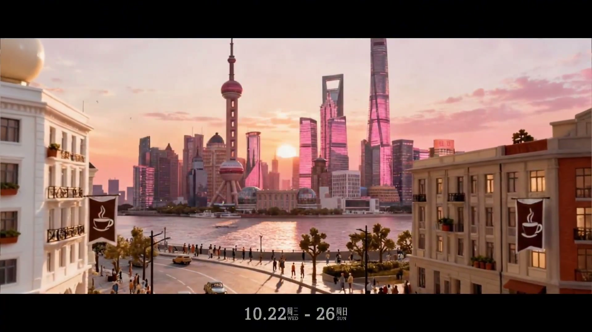

- **镜头12** `27.5–33.0` | 5.5s | 全景→中景 · 固定 | 蛋糕居中 / 多层庆典元素
  - 庆典红#E31E24 / 金色烟花#FFD700 / 暖光漫射
  - 十周年庆典蛋糕「A Decade of Togetherness」+「10」蜡烛，微缩乐队演奏（吉他+贝斯+小提琴），烟花绽放，飞艇「10th Anniversary」
  - 角色：微缩乐队+庆祝人群（欢呼/举杯） | 音效：烟花爆炸（低频boom+高频crackle）+人群欢呼 | 叙事：高潮——十年情感释放 | 特效：烟花粒子+彩带飘落+飞艇路径动画
  - 日期条：有
  - > 飞艇「10th Anniversary」不是独立镜头，是同一庆典场景的元素。
  - 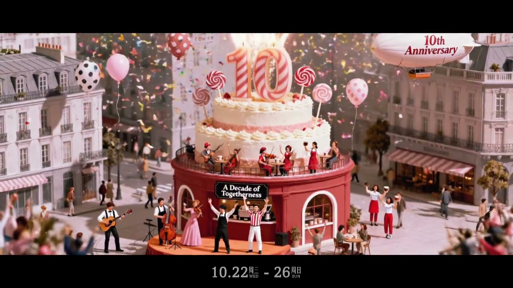

#### 场景5: 结尾 · 品牌定格（33.0–37.5）

- **镜头13** `33.0–35.0` | 2.0s | — | 两人物居中 / 白底
  - 纯白#FFFFFF / 红色点缀 / 平面光
  - 手绘插画过渡：两个卡通人物庆祝姿态，气球，烟花线条
  - 角色：两个卡通人物（红色连帽衫+红色鸭舌帽/眼镜） | 叙事：情绪过渡——庆典→品牌 | 特效：手绘插画转场
  - 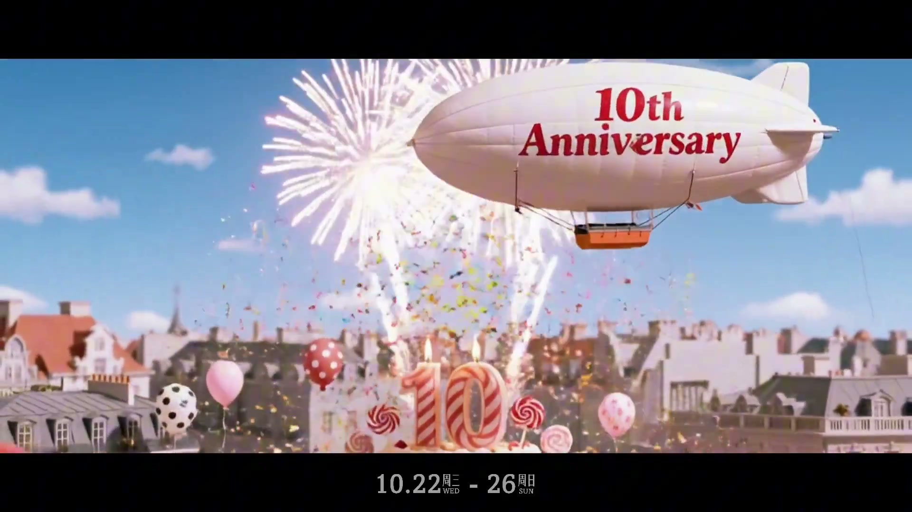

- **镜头14** `35.0–37.5` | 2.5s | — · 固定 | Logo 居中 / 白底
  - 纯白#FFFFFF / 品牌红#E31E24 / 平面光
  - Logo 定格：「COFFEE FESTIVAL / LUJIAZUI / SHANGHAI / EST. 2016」
  - 叙事：品牌确认——信息清零+强烙印
  - 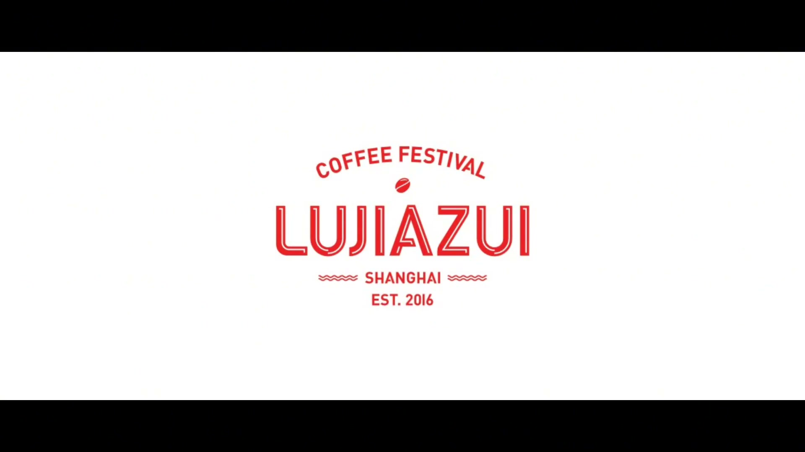

---

### 叙事节奏（→ Writer）

**全片节奏曲线**：慢起（5.5s 建立世界观）→ 渐快（1.0–3.0s 中段快速切换）→ 高潮停驻（5.5s 庆典最长镜头）→ 干净收束（4.5s 过渡+Logo）

| 场景 | 镜头数 | 总时长 | 平均时长 | 节奏特征 |
|------|:---:|------|------|------|
| 1 · 开场 | 2 | 5.5s | 2.75s | 慢起，给观众识别地标+理解世界观的时间 |
| 2 · 创意装置 | 3 | 5.5s | 1.83s | 加速，每个装置只给必要识别时间 |
| 3 · 城市融合 | 5 | 13.0s | 2.60s | 中速巡航，逐个探索6处融合，每处2-3s |
| 4 · 日落与庆典 | 2 | 9.0s | 4.50s | 减速，全景沉浸+高潮停留 |
| 5 · 结尾 | 2 | 4.5s | 2.25s | 快收，过渡+Logo 干脆利落 |

**叙事功能分布**：
- 引入世界观（镜头1–2）→ 展开奇观（镜头3–10）→ 情感高潮（镜头11–12）→ 品牌收束（镜头13–14）
- 咖啡元素复杂度递增：单一（轮船）→ 液体（牛奶/巧克力）→ 食物（冰淇淋）→ 器具=建筑（摩卡壶/粉锤/手柄）→ 艺术形态（拉花）→ 庆典（蛋糕）
- 无对白/无旁白，纯视觉叙事。品牌信息通过4个时间触点渐进释放：日期条（紧迫感）→ 飞艇「10th Anniversary」（周年分量）→ 蛋糕「A Decade of Togetherness」（情感深度）→ Logo「EST. 2016」（传承）

**转场**：全片硬切。节奏由音乐BPM + 剪辑时长控制，无特效转场。

---

### 镜头语言序列（→ DP）

**运镜分布**：12/14 固定机位（86%），1 缓推（镜头1），1 跟拍（镜头6），1 无运镜（手绘过渡）。全片无摇移/升降/变焦推拉。

**景别分布**：
- 全景 5（镜头1/2/8/11/12）—— 建立空间 + 情感高潮
- 中景 7（镜头3/4/5/6/7/9/10）—— 细节探索
- 平面 2（镜头13/14）—— 品牌定格

**构图模式**：
- 单主体居中：12/14（86%）—— 微缩模型风格核心特征：让观众聚焦精致细节
- 纵深对称：镜头1（两岸向消失点汇聚，利用透视引导视线进入微缩世界）
- 宽幅天际线：镜头11（水平方向展开所有建筑，释放累积的情感）

**镜头时长序列**：1.5→4.0→2.0→1.0→2.5→3.0→3.0→2.5→1.5→3.0→3.5→5.5→2.0→2.5
- 最短：镜头4（1.0s，摩卡壶快速识别）
- 最长：镜头12（5.5s，庆典蛋糕多层信息需时间消化）

**焦距与灯光**：
- 中长焦微距（等效100mm+）用于全景俯拍（镜头1/11），产生移轴式浅景深
- 中焦段（50-70mm）用于跟拍（镜头6）
- 微距（1:1-1:2）用于特写细节（镜头7咖啡豆、镜头9蒸汽）
- 灯光：晨光5000K→日光5600K→日落3200K→庆典暖光→平面白光

**重复曝光**：东方明珠出现4次（镜头1远景左/镜头3球体变形/镜头8背景/镜头11全景），每次角度+光线+角色均不同，用重复建立记忆点，用变化传递时间推进。

---

### 色调+场景搭建序列（→ Art Director）

| 场景 | 主色(hex) | 辅色(hex) | 色温 | 光源方向 | 核心道具 | 视觉重心 | 空间布局 |
|------|-----------|-----------|------|---------|---------|---------|---------|
| 1·开场 | 粉色江水#F4C2C2 | 建筑暖灰#C4956A | 5000K | 柔和漫射 | 咖啡豆轮船+主标题文字 | 船体居中 | 纵深对称/两岸汇聚 |
| 2·创意装置 | 深巧克力#5C3317 | 奶白#F5F5F0 | 5600K | 顶光+侧光45° | 牛奶球/摩卡壶/冰淇淋 | 装置居中 | 欧式广场/建筑围合 |
| 3·城市融合 | 中国红#C41E3A | 咖啡棕#6F4E37 | 5600K | 侧光45°+漫射 | 巴士/中国馆/粉锤/手柄/喷泉 | 融合物居中 | 街道+广场+城堡花园 |
| 4·日落庆典 | 日落金#E8A84C | 庆典红#E31E24 | 3200K | 金色逆光→暖光漫射 | 咖啡旗帜+蛋糕+飞艇 | 天际线→蛋糕居中 | 宽幅全景/广场 |
| 5·结尾 | 纯白#FFFFFF | 品牌红#E31E24 | — | 平面光 | Logo | Logo居中 | 纯平面 |

**色温变化曲线**：5000K→5600K→3200K→暖光→纯白。全片90%+暖色调，冷色仅零星出现（天空/绿植）且被全局暖光染色。

**光源方向演进**：柔和漫射（建立梦幻感）→ 45°侧光（突出微缩材质纹理，侧光:柔光≈3:1）→ 金色逆光（全片暖色最高潮）→ 平面白光（视觉清零）。

**材质还原要点**：混凝土粗糙感(#B0A89C)、玻璃幕墙反光高光(#D6E4F0冷蓝)、咖啡豆油光高光、摩卡壶金属拉丝——侧光+柔光箱组合突出纹理，无顺光扁平化。

**色彩策略**：地标标志色忠实保留（东方明珠银灰#C8CCD0、中国馆红#C41E3A、城堡粉#F4C2C2），咖啡主题色通过改造物体注入（棕/金/奶油），非覆盖地标本色。

---

### 角色设计序列（→ Writer + Art Director + DP + Sound）

> 本片无核心角色（无对白/无旁白/无具名人物）。微缩小人作为「城市居民」群体出现，承担氛围营造功能，不驱动叙事。

| 镜头 | 角色出现 | 行为 | 视觉特征 | 声音线索 |
|------|---------|------|---------|---------|
| 2 | 微缩小人（群体） | 草坪圆桌喝咖啡 | 日常便装、比例1:150 | — |
| 4 | 微缩小人（群体） | 摩卡壶亭前排队/广场行走 | 日常便装 | — |
| 5 | 微缩小人（群体） | 广场活动/围观冰淇淋 | 日常便装 | — |
| 6 | 微缩乘客（车内） | 坐在咖啡杯巴士内喝咖啡 | 通过车窗可见 | — |
| 8 | 微缩小人（群体） | 粉锤透明建筑内喝咖啡 | 日常便装 | — |
| 9 | 微缩小人（群体） | 穿行手柄透明通道 | 日常便装 | — |
| 10 | 微缩小人（群体） | 广场围观拉花喷泉 | 日常便装 | — |
| 12 | 微缩乐队+庆祝人群 | 演奏乐器/欢呼/举杯 | 乐队：吉他+贝斯+小提琴 | 人群欢呼（中频200-800Hz） |
| 13 | 两个卡通人物 | 互动庆祝姿态 | 红色连帽衫+红色鸭舌帽/眼镜 | — |

**角色功能总结**：微缩人群=世界观的「居民」，让静态模型被感知为活的城市。无个体特征分化，群体行为模式随场景情绪变化（悠闲→好奇→庆祝）。

---

### 音效序列（→ Sound）

> ⚠️ 基于 video_analyze 两遍交叉验证。帧抽图无法验证声音，已标注置信度。

| 场景 | 时间码 | 音效 | 类型 | 层次(dB) | 置信度 |
|------|--------|------|------|---------|:---:|
| 1 | 00:00 | 轮船汽笛（咖啡豆轮船） | Foley | 前景 +3~6 | 中 |
| 1 | 00:01-03 | 鸟鸣（绿地公园） | 环境音（微缩化） | 远层 -20 | 中 |
| 2 | 00:05 | 牛奶注入咕噜声 | Foley | 前景 | 中 |
| 2 | 00:08 | 摩卡壶蒸汽嘶嘶声 | Foley | 前景 | 中 |
| 3 | 00:11 | 巴士引擎声 | Foley | 前景 | 中 |
| 3 | 00:14 | 咖啡豆滚落清脆碰撞 | Foley | 前景 | 中 |
| 3 | 00:18 | 压粉器机械砰声 | Foley | 前景 | 中 |
| 3 | 00:21 | 咖啡机蒸汽喷射 | Foley | 前景 | 中 |
| 4 | 00:28-32 | 烟花爆炸（低频 boom + 高频 crackle） | 庆典音效 | 全频段 | 中 |
| 4 | 00:29 | 人群欢呼 | 环境音 | 中频 200-800Hz | 中 |

**声音层次架构**：
- 拟音（Foley）：~50%，混音前景（+3~6dB），每个器具声清晰如打击乐器
- 环境音：~20%，压低至-18~-24dB，低频切除（高通~200Hz）模拟微缩尺度听觉
- 音乐：~30%，轻快爵士/波萨诺瓦（钢琴+手风琴+轻打击乐），全程覆盖无静默
- 无旁白层。唯一「人声」= 镜头12 人群欢呼

**器具拟音驱动节奏**：汽笛→牛奶注入→蒸汽嘶嘶→咖啡豆碰撞→压粉器砰声→蒸汽喷射——每个声音预告下一个场景，拟音节奏与音乐BPM同步（±5BPM）。

**频率分离策略**（镜头12 庆典多层）：烟花低频50-150Hz / 欢呼中低频200-800Hz / 飞艇中频400-2kHz / 彩带高频2k-8kHz——4层声音各占专属频段，互不遮蔽。

---

### 特效序列（→ VFX）

| 场景 | 镜头 | 特效 | 类型 | 关键技术挑战 |
|------|:---:|------|------|------|
| 1 | 1 | 江面波纹动画 | 2D叠加 | 波纹节奏与船速匹配 |
| 1 | 2 | 白鸽飞行动画 | 路径动画 | 翅膀拍频+飞行弧线自然 |
| 2 | 3 | 牛奶液体注入+流动 | 实拍合成 | 液体粘稠度匹配微缩尺度（甘油+水调稠） |
| 2 | 5 | 巧克力酱淋下 | 实拍液体合成 | 跟踪+透视匹配+表面张力 |
| 3 | 7 | 咖啡豆散落物理模拟 | 3D粒子刚体 | 椭球刚体（8×5mm@1:150），重力+弹跳+堆积，前5-10粒路径清晰可追踪 |
| 3 | 9 | 蒸汽烟雾喷射 | 2D素材合成 | 扩散速度降至真实1/3-1/5，缩小湍流细节避免scale giveaway |
| 3 | 10 | 牛奶拉花动态形成 | 液体合成 | 咖啡与牛奶的扩散+纹路成形 |
| 4 | 11 | 江面波光（日落反射） | 灯光渲染 | 金色逆光+水面反射率 |
| 4 | 12 | 烟花粒子+彩带飘落+飞艇路径 | 多层粒子系统 | 烟花（高层·放射+重力+颜色渐变金→红→灭）+彩带（中层·扁平刚体+空气阻力+随机旋转）+飞艇（受控路径+偏航摇摆） |
| 5 | 13 | 手绘插画转场 | 2D动画 | 与前序实拍风格自然过渡 |

**特效密度曲线**：场景1-2（轻特效，1-2要素）→ 场景3（中特效，融合合成）→ 场景4（重特效，多层粒子高峰）。镜头12为全片特效密度峰值——三层纵深（烟花高层/彩带中层/蛋糕地面）。

---

### 分镜精选帧

> 存储路径：`assets/LJZ-COFFEE/frame_*.jpg`（14张，覆盖全部镜头）
> 消费方式：DP（构图参考）→ 取景类似 frame_01；Art Director（色谱采样）→ 比文字描述准；Storyboard（image_gen reference）→ 构图像这张，主体换成用户产品，色调保持暖棕

| # | 对应镜头 | 时间码 | 技法要点 | 路径 |
|---|:---:|--------|---------|------|
| 1 | 1 | 00:01.0 | 开场全景·纵深对称构图·咖啡豆轮船+东方明珠+外滩（DP构图参考） | assets/LJZ-COFFEE/frame_01_ship.jpg |
| 2 | 2 | 00:03.5 | 标题浮现·飞天雕塑+樱花+白鸽+小人（AD色板：樱花粉#FFB7C5） | assets/LJZ-COFFEE/frame_02_park.jpg |
| 3 | 3 | 00:06.5 | 牛奶注入·东方明珠球形装置（VFX液体合成参考） | assets/LJZ-COFFEE/frame_03_milk.jpg |
| 4 | 4 | 00:08.0 | 摩卡壶亭·Haussmann广场（场景搭建参考） | assets/LJZ-COFFEE/frame_04_moka.jpg |
| 5 | 5 | 00:09.5 | 巧克力酱·飞碟建筑背景（VFX液体+微缩融合参考） | assets/LJZ-COFFEE/frame_05_chocolate.jpg |
| 6 | 6 | 00:12.5 | 跟拍·咖啡杯巴士·motion blur（DP运动镜头参考） | assets/LJZ-COFFEE/frame_06_bus.jpg |
| 7 | 7 | 00:15.5 | 中国馆·咖啡豆散落（VFX粒子模拟参考） | assets/LJZ-COFFEE/frame_07_beans.jpg |
| 8 | 8 | 00:18.0 | 粉锤建筑·东方明珠背景·器具=建筑（创意策略核心帧） | assets/LJZ-COFFEE/frame_08_tamper.jpg |
| 9 | 9 | 00:20.0 | 迪士尼城堡+咖啡机手柄·透明小人通道（创意融合核心帧） | assets/LJZ-COFFEE/frame_09_disney.jpg |
| 10 | 10 | 00:22.5 | 拉花喷泉·牛奶注入（VFX动态液体参考） | assets/LJZ-COFFEE/frame_10_latteart.jpg |
| 11 | 11 | 00:26.0 | 日落全景·粉紫色逆光（AD全片暖色最高潮色谱） | assets/LJZ-COFFEE/frame_11_sunset.jpg |
| 12 | 12 | 00:29.5 | 十周年蛋糕·烟花+乐队+飞艇（庆典多层粒子参考） | assets/LJZ-COFFEE/frame_12_cake.jpg |
| 13 | 13 | 00:32.0 | 飞艇「10th Anniversary」·手绘过渡前最后一帧（品牌触点参考） | assets/LJZ-COFFEE/frame_13_airship.jpg |
| 14 | 14 | 00:36.5 | Logo定格·白底红字「EST. 2016」（品牌视觉参考） | assets/LJZ-COFFEE/frame_14_logo_v2.jpg |

---

### 消费映射速查

| 角色 | 激活阶段 | 读拉片层 | 分镜图用途 |
|------|:---:|------|------|
| Writer | P2/P4 | §叙事节奏（镜头时长分布、功能标记） | frame_01→02→11→12（叙事转折帧） |
| DP | P4 | §镜头语言序列（景别/构图/运镜分布/焦距） | frame_01（纵深对称）、frame_06（跟拍）、frame_11（宽幅全景） |
| Art Director | P3 | §色调+场景搭建序列（5场景色谱表+光源演进+材质还原） | frame_02（樱花粉）、frame_07（中国红+咖啡棕）、frame_11（日落金） |
| Sound Designer | P5 | §音效序列（10音效触发点+声音层次架构） | 间接——从镜头时长分布推节奏密度 |
| VFX | P6 | §特效序列（10特效镜头+关键合成挑战） | frame_07（豆子散落）、frame_12（烟花多层） |
| Storyboard | P6 | 全量 + 分镜图 | image_gen composition reference |
