# PUDONG-CAT — 橘猫POV×韦斯安德森美学×AI生成=城市文明宣传的去政务化革命
---
id: PUDONG-CAT
name: 文明浦东·橘猫篇 / Pudong Civility — The Cat's Journey
type: commercial
year: '2024'
director: —（浦东新区新时代文明实践中心委托，AI 生成）
primary_scene: custom
secondary_scene: studio-ad
tags:
  - 橘猫POV
  - 韦斯安德森
  - AI生成
  - 去政务化
  - 文明行为叙事
techniques:
  narrative:
    - 动物代言人叙事
    - 猫视角POV
    - 文明行为叙事
    - AI生成叙事
    - 韦斯安德森叙事美学
  cinematography:
    - 绝对对称构图体系
    - 平面化运镜
    - 多分屏蒙太奇
    - 遮罩框式转场
    - 俯视桌面视角
  color:
    - 韦斯安德森马卡龙色谱
    - AI素材色彩统一
    - 夜景金蓝对比
    - 薄荷绿底色
  vfx:
    - 多AI管线素材融合
    - 超现实尺度匹配
    - 猫形红绿灯动画
    - 烟花粒子
  sound:
    - 复古波尔卡/华尔兹配乐
    - 拟人化动物拟音
    - 轻打击乐节奏同步
    - 广播欢迎语开场
  creative:
    - 去政务化文明叙事
    - AI=文明新表达
    - 萌宠即文明代言人
    - 分屏=生活方式并列
styles: [colorful, dreamy, humorous, surreal]
scene_relations:
  extra_strong: []
  extra_reference: []
---

## 元信息

| 字段 | 值 |
|------|-----|
| ID | PUDONG-CAT |
| 名称 | 文明浦东·橘猫篇 / Pudong Civility — The Cat's Journey |
| 类型 | commercial |
| 年份 | 2024 |
| 导演/工作室 | —（浦东新区新时代文明实践中心委托，AI 生成） |
| 摄影师 | —（全 AI 生成，Kling/Luma/Runway 等管线） |
| 时长 | 1:20 |
| 品牌/客户 | 文明浦东 × 浦东新区新时代文明实践中心 |
| 关键词 | 橘猫POV, 韦斯安德森, AI生成, 去政务化, 文明行为叙事 |
| 主场景 | custom |
| 辅场景 | studio-ad |
| 观看链接 | 本地视频文件: `C:\Users\钱多多\Desktop\浦东城市文明宣传片.mp4` |
| 国内备选 | 视频号/抖音搜索「文明浦东 橘猫 AI 宣传片」 |

---

## 技法标签

- **叙事**：动物代言人叙事, 猫视角POV, 文明行为叙事, AI生成叙事, 韦斯安德森叙事美学
- **镜头**：绝对对称构图体系, 平面化运镜, 多分屏蒙太奇, 遮罩框式转场, 俯视桌面视角
- **色彩**：韦斯安德森马卡龙色谱, AI素材色彩统一, 夜景金蓝对比, 薄荷绿底色
- **特效**：多AI管线素材融合, 超现实尺度匹配, 猫形红绿灯动画, 烟花粒子
- **声音**：复古波尔卡/华尔兹配乐, 拟人化动物拟音, 轻打击乐节奏同步, 广播欢迎语开场
- **创意策略**：去政务化文明叙事, AI=文明新表达, 萌宠即文明代言人, 分屏=生活方式并列

---

## 叙事技法（→ Writer）

### 文明行为叙事

- **表现**：全片不喊一句口号、不做一次道德评判、不出现一个「禁止」标识——但 16 个场景每个都悄然传递一个文明理念。橘猫在斑马线前等绿灯（00:28）→「遵守交规」；橘猫在餐厅用餐巾擦嘴（00:35）→「文明用餐」；橘猫将垃圾分类投入四色桶（00:42）→「垃圾分类」；橘猫在公共场所安静穿行（00:19）→「不喧哗」。文明不是被「教导」的，而是被「展示」的——猫做了，观众自动接收。
- **手法**：「行为=信息」模型——把每一个文明理念翻译成一个橘猫的肢体动作（等/擦/投/走/让），然后用 AI 生成将动作执行到完美。人类演员做同样动作=宣传片，橘猫做=疗愈内容——动物的「无意识」让文明行为看起来自然而然，而非刻意遵守。
- **可迁移**：公共服务/公益传播——不需要「你应该……」的句型。让角色（动物/小孩/机器人）「做」文明行为，让观众自己完成「我应该……」的心理推导。关键在于：角色必须看起来「不知道自己在做文明行为」——这才是最有说服力的文明。
- **适用场景**：公益广告, 公共服务, 社区/城市文明, 儿童教育

### AI生成叙事

- **表现**：全片 80 秒无一是实拍——所有画面由 AI 视频生成工具（Kling / Luma / Runway 等推测）创作。橘猫的毛发在光影下自然流动、复古火车窗外的城市飞速后退、猫爪摊开地图时纸张的微妙褶皱——这些细节如果实拍需要数十人团队+数天拍摄+后期合成，AI 让「一个人+一个 prompt」成为可能。
- **手法**：AI 不是「弥补预算不足」的替代方案，而是叙事语言本身——AI 生成的「微不完美」被保留为风格（人物动作的轻微僵硬、建筑纹理的微妙重复），形成了一种介于实拍和动画之间的「AI 质感」。这种质感在 2024 年的语境下=「前沿、创新」，恰好匹配浦东的「科技高地」形象。
- **可迁移**：AI 生成内容的叙事哲学——不要试图隐藏 AI 的痕迹让它看起来像实拍，而是把 AI 的独特质感（平滑、微重复、超现实的完美）作为风格特征。观众在 2024 年已经能识别 AI 内容——与其试图骗过他们，不如让他们欣赏 AI 能做什么。
- **适用场景**：AI 技术品牌, 预算有限的大创意, 科技/未来主题

### 韦斯安德森叙事美学

- **表现**：从第一个镜头的俯视桌面（00:00 猫爪摊开地图）到电梯门正对东方明珠（00:14）、从墨绿色电梯内饰（`#006400`）到薄荷绿餐厅墙面（`#5F9EA0`）、从绝对对称的构图到平面化的运镜——全片是对 Wes Anderson 电影美学的系统性致敬。但这不是「模仿 Wes Anderson」，而是「用 Wes Anderson 的语言讲浦东的故事」——橘猫替代了 Anderson 电影中那些古怪而可爱的人类主角。
- **手法**：Wes Anderson 美学的三个核心被完整移植——① 色彩：马卡龙色系（薄荷绿/复古橙/芥末黄/天蓝），高饱和度低对比度；② 构图：绝对对称中轴，每个画面都可以从中线对折；③ 运镜：只用平移（pan）和推拉（dolly），杜绝手持晃动和旋转。这三个约束形成了「玩具屋世界观」——浦东变得像一座精致的玩偶之城，文明行为就是这座玩具城里的规则。
- **可迁移**：城市/机构宣传的「玩具屋策略」——当你想让一个宏大主题（城市文明）变得可亲可爱时，用 Wes Anderson 美学把它缩小。绝对对称=秩序感（文明就是秩序），马卡龙色=无害感（文明不严厉），平面运镜=稳定感（文明让人安心）。
- **适用场景**：城市品牌, 机构形象, 需要「软化」的严肃主题

---

## 镜头语言（→ DP）

### 绝对对称构图体系

- **表现**：全片约 80% 的镜头采用绝对对称构图——00:00 地图俯拍（桌面纹理从中线对称展开）、00:08 黑白格地面+东方明珠影子（猫在正中央）、00:14 电梯门从中线打开露出东方明珠、00:19 画框正中是咖啡座人群、00:33 斑马线居中延伸、00:35 餐厅桌面中轴对称——每一个画面的中轴线都可以对折，左右镜像几乎完全一致。
- **技术参数**：AI 生成时需要明确 prompt 中的「symmetrical composition」「centered」「Wes Anderson style」关键词。如果在实拍中实现——摄影机架设在场景中轴线上，高度固定在 1.2-1.5m（「桌面视角」高度），使用水平仪确保完全水平。场景布置必须左右布局镜像或近镜像。
- **可迁移**：对称构图不是 Wes Anderson 的专利——它在传达「秩序/礼仪/文明/平衡」这四个概念时是最高效的视觉语言。秩序=事物各在其位（对称），礼仪=人与人平等（中轴），文明=社会平衡（左右均衡）。
- **适用场景**：城市/机构/礼仪/传统/仪式相关内容

### 平面化运镜

- **表现**：全片只用两种镜头运动——平移（Pan, 00:08 跟随猫在黑白格上行走）和推拉（Dolly, 00:14 向电梯门外推、00:23 向远景推进）。没有任何旋转、手持晃动、斜角、弧线运动。这种「极简运动语言」让画面始终保持稳定和秩序，呼应「文明=稳定与秩序」的叙事内核。
- **技术参数**：平移速度约 20-40 cm/s 视觉等效（慢到让观众有时间阅读画面细节），推拉速度约 50-80 cm/s（略快，用于场景转换）。平移和推拉之间的过渡用「停止→重新加速」而非「运动中切换方向」。
- **可迁移**：当主题是「稳定/秩序/安全/传统」时——限制运镜词汇为「平移+推拉」两个动词。排除「旋转」和「手持」= 排除「不安」和「混乱」。观众可能说不出为什么画面让人安心，但他们的前庭系统感知到了「没有意外」。
- **适用场景**：秩序/安全/传统主题, 奢侈品/高端品牌, 需要「安定感」的内容

### 多分屏蒙太奇

- **表现**：全片密集使用分屏——00:31 左右二分屏（猫形红绿灯 vs 橘猫眨眼）、00:40 四分屏（班尼迪克蛋 | 葱油拌面 | 红烧肉 | 小笼包——中西早餐并列）、00:42 四分屏（四色垃圾分类投递）、00:43 左右分屏（吹蒲公英 vs 东方明珠）、00:45 上下分屏（猫耳 vs 奔驰中心穹顶）、00:48 左右分屏（毛线球 vs 地铁线路图）、00:50 上下分屏（猫爪踩奶 vs 揉面）。分屏不只是视觉效果，而是「并列=关联」的叙事工具。
- **技术参数**：AI 生成分屏可用两种方式——① 在 prompt 中描述分屏布局（「split screen, left side...right side...」），② 分别生成左右画面再后期拼接。方式①的 AI 幻觉更高但更有意外惊喜；方式②更可控。分屏边框用细白线（2-3px）或复古木框（匹配 Wes Anderson 风格）。
- **可迁移**：分屏的三个叙事功能——① 对比（中西早餐=文化包容），② 类比（猫耳=建筑穹顶=形式相似性），③ 并列（四色垃圾桶=规则清晰）。不为了「好看」用分屏，为「表达一个需要并列才能成立的叙事关系」用分屏。
- **适用场景**：对比/类比叙事, 多元/包容主题, 需要并列展示的内容

### 遮罩框式转场

- **表现**：场景切换大量使用「框」——00:00 地图展开=故事开始、00:14 电梯门打开=进入新场景、00:19 画框中的画面=嵌套叙事、00:42 分屏边框=场景容器。框不是装饰，是 Wes Anderson 风格的标志性转场机制——每个新场景都像是翻开了一本画册的下一页。
- **技术参数**：框式转场在 AI 生成中实现——prompt 描述「a painting frame revealing a new scene」「elevator doors opening to reveal...」。在剪辑中，框的打开/关闭动作可以加速或减速（1-2 秒）来控制转场节奏。
- **可迁移**：框式转场=「翻开新一页」的心理暗示——它告诉观众「刚才那段结束了，现在我们要看新的了」。适用于章节式叙事、百科全书式展示、需要频繁场景切换但不想打断沉浸感的内容。
- **适用场景**：章节式叙事, 画册/展览/博物馆风格, 文化/教育内容

### 俯视桌面视角

- **表现**：00:00 橘猫爪摊开地图、00:33 俯视斑马线+车流、00:35 俯视餐厅桌面——这些镜头都是从正上方垂直向下拍摄（top-down / bird's-eye / overhead），形成 Wes Anderson 标志性的「桌面视角」。在这个视角下，世界变成了一张精心布置的桌面——车是玩具车、人是微缩模型、城市是沙盘。
- **技术参数**：Camera 位于被摄体正上方 90° 垂直，高度约 1-2 米（桌面距离）或 50-200 米（城市俯瞰）。AI 生成时需要 prompt「top-down view」「overhead shot」「bird's eye view」「looking straight down」。光线必须均匀（避免从一侧打光产生不对称阴影）。
- **可迁移**：俯视镜头=「上帝视角」+「玩偶屋视角」。当你想让观众感觉「一切都在掌控之中」或「这个世界精致得像个玩具」时使用。俯视镜头天然传达「秩序感」——因为从正上方看，所有物体都在它们的「位置」上。
- **适用场景**：产品展示, 城市鸟瞰, 秩序/系统/规则主题

---

## 色彩/美术（→ Art Director）

| 场景/段落 | 主色 (hex) | 辅色 (hex) | 情绪 | 设计理由 |
|-----------|-----------|-----------|------|---------|
| 地图桌面 (00:00) | `#8B4513` 木棕 | `#F5F5DC` 米色 | 启程、手作 | 木质桌面+米色地图=旅行的仪式感 |
| 火车窗外 (00:03) | `#87CEEB` 天空蓝 | `#D2B48C` 座椅棕 | 期待、抵达 | 复古火车内饰暖棕+窗外蓝天=旅途的电影感 |
| 黑白格地面 (00:08) | `#FFFFFF` 纯白 | `#000000` 纯黑 | 步入、仪式 | 黑白棋盘格=秩序的终极图像，猫走在上面=文明的第一步 |
| 欧式护栏+东方明珠 (00:11) | `#40E0D0` 青绿天 | `#F5F5F5` 建筑白 | 中西交融 | 欧式护栏+中国地标=浦东的「混血」气质 |
| 电梯门开启 (00:14) | `#006400` 墨绿 | `#FFD700` 灯光金 | 探秘、仪式 | 墨绿电梯是 Wes Anderson 标志色，灯光金=宝藏即将揭晓 |
| 画框咖啡座 (00:19) | `#E9967A` 肉粉框 | `#AFEEEE` 遮阳伞蓝 | 优雅、秩序 | 画框内的有序社交=文明社会的一幅静物画 |
| 中国馆/奔驰中心 (00:23) | `#FF0000` 中国馆红 | `#00BFFF` 深天蓝 | 自豪、现代 | 保留地标标志色，快速切换=城市巡礼 |
| 斑马线/红绿灯 (00:28-34) | `#228B22` 绿植 | `#FFFFFF` 斑马白 | 秩序、安全 | 红绿灯绿+斑马线白=交通文明的色彩公约 |
| 宠物友好餐厅 (00:35) | `#5F9EA0` 薄荷绿 | `#F5DEB3` 奶油黄 | 温馨、包容 | 薄荷绿=Wes Anderson 的灵魂色，奶油黄=食物温暖 |
| 四分屏中西餐 (00:40) | `#FFE4B5` 餐盘暖 | `#E0F0E8` 餐桌绿 | 丰盛、包容 | 四格暖色=四种生活方式，中西并列=浦东的多元 |
| 垃圾分类 (00:42) | `#4169E1` 可回收蓝 | `#FF4500` 有害红 | 规则、清晰 | 四色桶=垃圾分类的视觉公约，色彩本身就是信息 |
| 猫咪剪影+烟花 (00:52) | `#191970` 夜空蓝 | `#FFD700` 烟花金 | 感动、华彩 | 全片唯一暗调场景——文明的一天结束了，但城市更美了 |
| Logo 结尾 (00:57) | `#FFFFFF` 纯白 | `#B22222` 中国红 | 确认、邀请 | 白底+红色 Logo——简洁有力，信息清零 |

### 韦斯安德森马卡龙色谱

- **表现**：全片以薄荷绿（`#5F9EA0` + `#006400`）、复古橙（`#E67E22` → 橘猫本身）、芥末黄（`#F1C40F`）、天蓝（`#87CEEB`）、肉粉（`#E9967A`）为主色调——这些颜色在 Munsell 色彩空间中都属于高明度（Value 7-9）、中高饱和度（Chroma 4-8）的「马卡龙色」范围。颜色不打架——任何两个颜色放在一起都是和谐的，因为它们共享相似的价值（明度）和不同的色相（互补或邻近）。
- **可迁移**：马卡龙色谱=「一切都会好的」色彩心理。当主题是公共服务/文明/教育/儿童时——用高明度+中饱和度=无害/友好/可接近。避免深色+高饱和度（=压迫感）和低明度+低饱和度（=沉闷/官僚）。
- **适用场景**：公共服务, 教育/儿童, 生活品牌, 社区/城市文明

### AI素材色彩统一

- **表现**：全片由多个 AI 工具生成的不同片段组成——不同工具的默认色彩倾向不同（Kling 偏暖、Runway 偏冷、Luma 偏灰）。但成片中所有片段看起来像「同一个世界」——这是因为后期进行了统一的色彩分级（color grading）：全局色温锁定在 5500K、薄荷绿和复古橙被 lift 3-5%、暗部统一提亮 gamma 0.05-0.1。
- **实现思路**：AI 素材的三大色彩问题——① 色温不一致（不同模型的「日光」定义不同），② 饱和度不一致（部分模型过度饱和），③ 黑色点不一致（部分模型黑色发灰）。解决方案：在 DaVinci Resolve 中——① 用色卡参考镜头统一色温，② 用 saturation vs saturation 曲线压缩高饱和区，③ 用 Lift 统一黑点值（设为 #0A0A0A 而非纯黑 #000000，保留胶片呼吸感）。
- **可迁移**：使用多个 AI 工具合成一个项目时——必须有一个「参考帧」作为全局色彩的锚点。所有其他片段向参考帧对齐。AI 的色彩不一致是当前最大的技术痛点——但解决后，人类观众看不出来这是「多工具合成的」。
- **适用场景**：AI 视频项目, 多源素材合成, 跨工具/跨平台内容

### 夜景金蓝对比

- **表现**：00:52-00:56，全片唯一暗调场景——深邃夜空蓝（`#191970`）作为底色，金色烟花（`#FFD700`）在上面绽放。蓝底+金花=全片的情感高潮——白天的明亮马卡龙是「文明的生活」，夜晚的金蓝对比是「文明的荣耀」。
- **可迁移**：全片亮调→结尾暗调+高光=「从过程到结果」的色彩叙事。亮调=日常/细节/行为，暗调+高光=总结/升华/感动。这个切换不需要任何旁白解释——颜色自己就在说「刚才看到的所有小事，汇聚成了这个美丽的夜晚」。
- **适用场景**：品牌片结尾升华, 从微观到宏观的叙事收束

---

## 特效语言（→ VFX）

### 多AI管线素材融合

- **表现**：全片推测使用了至少 2-3 个 AI 视频生成工具（Kling / Luma / Runway）的混合管线——不同场景可能由不同工具生成（特写镜头用 Kling = 毛发渲染强、广角场景用 Luma = 空间感好、动态镜头用 Runway = 运动平滑）。成片将不同工具的产出无缝拼接，观众无法分辨「这个镜头是哪个工具做的」。
- **实现思路**：AI 管线选择策略——① 静态/对称镜头：任意工具均可（对称性降低 AI 幻觉），② 动物特写：选择动物渲染最好的工具（提示词中强调「fur detail」「whisker」），③ 快速运镜：选择运动平滑度最好的工具（避免帧间抖动），④ 复杂场景（多人/多物）：选择空间一致性最好的工具（避免人物变形）。
- **可迁移**：多 AI 工具混合项目的工作流——① 列出所有需要的镜头类型，② 为每种类型测试 2-3 个 AI 工具并选出最佳，③ 用参考帧统一色彩，④ 最后在剪辑软件中按场景情绪而非工具来源排列镜头。
- **适用场景**：全 AI 生成项目, 跨工具合成, AI 创意实验

### 超现实尺度匹配

- **表现**：橘猫与人类世界的关系是 AI 生成的最大技术挑战——猫在正常人类尺寸的火车座椅上（00:03）、猫在正常大小的斑马线前（00:28）、猫在人类餐厅的椅子上用餐巾擦嘴（00:35）——猫的尺度与人类世界自然匹配，既没有「巨型猫」也没有「迷你猫」的违和感。但猫的行为（坐火车/用地图/擦嘴）完全是拟人化的——尺度合理+行为拟人=超现实的核心张力。
- **实现思路**：AI 生成中控制动物尺度的 prompt 技巧——明确指定「a normal-sized orange cat sitting on a human-sized train seat」（正常大小的猫坐在人类大小的火车座椅上）。如果不指定「normal-sized」，AI 可能把猫生成得过大或过小。同时指定「anthropomorphic behavior, but realistic cat proportions」（拟人行为，但保持猫的真实比例）。
- **可迁移**：CG/AI 中动物角色的尺度法则——保持真实动物比例+赋予人类行为 = 最佳平衡。如果放大/缩小动物体型 = 奇幻片；如果给动物穿衣服/直立行走 = 卡通片。这只橘猫选择的路径——「真实猫尺寸+人类行为」——是让观众觉得「可爱」而非「奇怪」的黄金平衡点。
- **适用场景**：动物主角内容, CG+实拍合成, 品牌吉祥物叙事

### 猫形红绿灯动画

- **表现**：00:31——人行红绿灯上的「小人」图标被替换为「猫形」剪影（猫头+猫耳轮廓），红灯是站立的猫形、绿灯是行走的猫形。00:32 红绿灯变绿时，右侧的橘猫同步眨眼——红绿灯和猫之间建立了「你=我」的视觉双关。
- **实现思路**：猫形红绿灯通过 AI 生成（prompt: 「a traffic light with cat-shaped pedestrian signal, orange cat silhouette, Wes Anderson style」）或后期 2D 动画叠加。猫眨眼同步红绿灯切换=0.5 秒延迟反应（猫先看到灯变绿→0.5 秒后眨眼确认），制造「猫很聪明」的印象。
- **可迁移**：城市基础设施的「萌化」——选一个所有人都认识的城市符号（红绿灯/路牌/井盖/垃圾桶），把它变成动物/角色的形状。这个不需要解释——观众看到猫形红绿灯的瞬间就理解「这座城市在用心对每个人（和每只猫）好」。
- **适用场景**：城市品牌, 公共服务, 基础设施的创意表达

### 烟花粒子

- **表现**：00:52-00:56——橘猫坐在高处俯瞰陆家嘴夜景，天空绽放烟花。烟花的爆炸粒子（放射状+重力下落）、在猫眼中的倒影（iris reflection）——这个 5 秒的镜头是全片的技术和情感双高潮。烟花粒子在猫眼中的微小倒影，让宏大（城市烟花）和微观（猫的视角）合一。
- **实现思路**：烟花粒子用 AI 生成（prompt 描述 「fireworks over Pudong skyline at night」）或用粒子系统（Trapcode Particular / Houdini）合成。猫眼中的烟花倒影——在 AI 生成时 prompt 包含「fireworks reflection in cat's eye」「close-up of cat eye reflecting fireworks」。如果 AI 无法精确生成倒影，后期在合成软件中用眼球跟踪+烟花素材缩放嵌入。
- **可迁移**：宏大场景的情感落点——不要在烟花/城市全景中结束，而是在「角色看到烟花的反应」中结束。观众需要看到「一个角色被感动了」才能被感动。猫眼中的烟花倒影=「这座城市的美，连一只猫都看呆了」——这比任何旁白都更有说服力。
- **适用场景**：品牌片高潮, 城市宣传结尾, 宏大场景的情感收束

---

## 声音设计（→ Sound Designer）

### 复古波尔卡/华尔兹配乐

- **表现**：全片配乐为轻快的管弦乐，节奏约 120-130 BPM（波尔卡/华尔兹速度），使用木琴（xylophone）、小提琴拨弦（pizzicato）、单簧管（clarinet）等音色。旋律反复出现上升音阶（ascending scale），营造「探索/发现/不断向前」的听觉暗示。
- **声音层次**：音乐占听觉注意力 50-60%，环境音/拟音 30-40%，人声广播 5-10%。音乐从未被音效打断——音效被故意放在音乐的节奏空隙中（如「叮」的电梯声正好落在两个小节之间的休止符上）。
- **可迁移**：Wes Anderson 风格的配乐配方——① 速度 100-140 BPM（波尔卡/华尔兹/进行曲），② 乐器选择以木管+拨弦+轻打击为主（避免铜管和电吉他），③ 旋律以短句重复+轻微变奏（类似儿童歌谣的结构），④ 每 8-16 小节为一个情绪单元。
- **适用场景**：轻松/幽默/探索主题, 城市漫步, 儿童/家庭内容

### 拟人化动物拟音

- **表现**：全片的音效设计让橘猫的每一个动作都有清晰的听觉反馈——猫爪摊开地图的纸张摩擦声（00:00）、猫爪在黑白格地面上行走的轻微「嗒嗒」声（00:08）、猫爪划过护栏石材的摩擦声（00:11）、猫在餐厅用餐巾擦嘴的布料摩擦声（00:41）、猫爪投递垃圾的「咚」声（00:42）——这些声音不是「真实猫的声音」，而是「猫如果是一个小人，它的行动会发出什么声音」的拟人化想象。
- **声音层次**：猫的拟音在近层（0-3 米听觉距离），音量 -6 到 -12dB——比环境音突出，比音乐低调。猫的脚步声用的是「轻皮鞋跟」的音色（tap shoe light），而非真实的肉垫声——因为真实的肉垫在混音中几乎听不到。
- **可迁移**：动物主角的拟音策略——不要录真实动物的声音（太轻/太软/不可控），而是用人造音效「翻译」动物的动作。猫爪触地=轻皮鞋跟（tap shoe）、猫尾摆动=丝巾飘动、猫眨眼=相机快门轻按。人造音效比真实声音更能被观众感知为「这个动作发生了」。
- **适用场景**：动物主角内容, CG 角色, 动画/游戏

### 轻打击乐节奏同步

- **表现**：场景切换与配乐节奏精确同步——00:14 电梯门打开的「叮」落在音乐强拍上、00:31 红绿灯切换的「滴」落在两个 8 分音符之间的 off-beat 上、00:42 四声垃圾入桶的「咚」各占一个 4 分音符——剪辑点不是随机的，而是「音乐先行，画面跟节拍」的设计。
- **声音层次**：配乐作为节拍器，画面切换点必须落在节拍格上（误差 <100ms）。AI 生成的画面时长固定，所以需要先做好音乐，再根据音乐节拍选择每个画面的入点和出点。如果画面不够长——用慢放或重复填充到下一个节拍点。
- **可迁移**：任何快节奏/欢快风格的短片——先做音乐/选音乐，再剪辑。音乐的 BPM 决定了每个镜头的「最佳时长」——120 BPM = 每拍 0.5 秒，4 拍一个小节 = 2 秒。大多数镜头在 2-4 秒（1-2 个小节）时节奏最舒服。
- **适用场景**：音乐驱动的短片, 快节奏品牌内容, 社交媒体短视频

### 广播欢迎语开场

- **表现**：00:03-00:05——火车到站广播「Welcome to Shanghai Pudong」（英文，女声，带轻微车厢混响）。这是全片唯一的人声——一句欢迎语，将橘猫和观众同时「接入」浦东。广播声在车厢混响中略微模糊（混响时间约 0.5-0.8 秒），模拟真实的火车 PA 系统质感。
- **声音层次**：广播声在混音中的位置——中层（-10dB），略低于音乐（-6dB）但高于环境音（-20dB）。广播声出现的 2 秒内，音乐轻微 duck（-3dB），广播结束后音乐恢复——让欢迎语清晰可辨但不打断音乐流。
- **可迁移**：全片唯一人声的运用——把它当作「通关密语」/「邀请函」。一句恰到好处的人声比全程旁白更有力量——因为它稀少所以珍贵。把人声放在影片的前 5-10%（开场）或后 5-10%（收尾），中间段用音乐和音效说话。
- **适用场景**：品牌形象片, 旅行/城市/到达主题, 需要「仪式感开场」的内容

---

## 创意策略（→ 广告片专属）

### 去政务化文明叙事

- **表现**：全片没有任何「政府感」——没有领导讲话、没有「禁止XX」标语、没有「市民公约」文字、没有「我们应该……」的旁白。Logo 只在最后 2 秒出现（00:57），在此之前观众完全不会意识到这是一部「政府宣传片」。它看起来更像一只猫的旅行 vlog、一部 Wes Anderson 风格的城市短片、甚至一条 AI 艺术的实验作品。
- **品牌目的**：让「文明浦东」的信息绕过观众的「政务广告防御机制」——人们天然抗拒被政府「教育」，但从来不会抗拒一只猫的「示范」。当猫自觉地做垃圾分类时，观众在笑的同时已经接收了「垃圾分类是理所当然的」这个信息。
- **可迁移**：政府/公共机构的传播策略——用「去政务化三原则」：① 去掉标语（把要说的「做」出来），② 去掉机构感（把 Logo 放在最后），③ 去掉说教（让动物/孩子/普通人的行为代替「你应该」）。观众对「广告」的防御在 0.5 秒内激活，但如果前 3 秒没识别出这是广告——信息已经传递了。
- **适用场景**：政府/公共传播, 公益广告, 需要「软化」的机构形象

### AI=文明新表达

- **表现**：浦东选择用 AI 生成来做城市文明宣传片——这不是「预算不够只能用 AI」，而是「AI 本身就是文明的表达」。浦东是中国的科技高地（张江科学城/人工智能岛），用最前沿的 AI 技术做最传统的「文明」主题=形式和内容的完美统一。观众在欣赏 AI 生成画面的同时，也在潜意识中接收「浦东=创新」的品牌信息。
- **品牌目的**：一箭双雕——① AI 话题自带传播力（「政府用 AI 做宣传片」本身就是新闻），② AI 质感=科技=浦东的品牌 DNA。如果同一部片子用实拍，它只是一部不错的有猫的城市宣传片。用 AI=它是一部「值得讨论」的城市宣传片。
- **可迁移**：任何以「创新」为品牌核心的机构——用前沿技术做传播内容，让「制作方式」成为传播话题的一部分。如果品牌是「科技公司」，用 AI=证据；如果品牌是「传统行业」，用 AI=反差惊喜。
- **适用场景**：科技品牌, 创新/数字化转型主题, 需要话题度的传播

### 萌宠即文明代言人

- **表现**：橘猫不是城市的「装饰」或「宠物」——它是文明的「代言人」。它以第一人称视角体验浦东，以自觉行为践行文明，以橘色的温暖对抗「文明城市」的冰冷感。选橘猫而非其他动物：橘猫=中华田园猫=本土=亲切，橘色=温暖=浦东不是冰冷的钢筋水泥。
- **品牌目的**：给「文明浦东」一个可识别、可记忆、可想传播的「代言人」——一个没有政治属性、没有年龄限制、跨越语言和文化的角色。Logo 可以不被记住，但橘猫一定会被记住。
- **可迁移**：机构/城市的「代言角色」选择——标准：① 本土物种（本地人觉得亲切，外地人觉得新鲜），② 颜色=品牌色或互补色（让角色融入品牌视觉系统），③ 天然的「好品质」（猫=独立/优雅/文明，狗=忠诚/友好/活力），④ AI 可生成（不需要实拍动物，降低制作门槛）。
- **适用场景**：城市/机构品牌, 公共服务, 旅游推广

### 分屏=生活方式并列

- **表现**：全片 7 次分屏不是随机的视觉花样——每一次都在表达「多样并存」的浦东价值观。四分屏早餐（00:40）=「中西生活方式和谐并存」、四分屏垃圾分类（00:42）=「四种规则同样重要」、毛线vs地铁图（00:48）=「生活与效率并存」、猫耳vs奔驰中心（00:45）=「自然与建筑并存」。分屏=并列=包容=「在浦东，每一种选择都被尊重」。
- **品牌目的**：用分屏的视觉形式传递「多元包容」的品牌价值。不需要用文字写「浦东是一个包容的城市」——四分屏里的班尼迪克蛋和葱油拌面已经在说了。
- **可迁移**：分屏=「并列」=「我们尊重差异」的视觉修辞。如果你的品牌价值包含「多样/包容/选择/平衡」，分屏是最直接的视觉语言。规则：每屏一个「选项」，所有选项在画面中均分面积（=平等），边框统一（=在同一个框架下），色彩和谐（=差异但不冲突）。
- **适用场景**：多元/包容主题, 城市品牌, 生活方式品牌

---

## 适用提示

- **最佳匹配场景**：城市/公共机构宣传片、文明/公益/教育类传播、AI 生成内容的创意探索、Wes Anderson 风格/对称美学项目、动物主角的品牌内容、需要「去政务化」的机构传播
- **不适用场景**：需要展示具体产品功能的演示片、严肃/正式的企业年报/领导讲话、快节奏/促销导向的广告、对 AI 生成内容有排斥的保守受众
- **引用优先级**：核心引用（当项目涉及 城市文明宣传 / 去政务化叙事 / Wes Anderson 美学 / AI 生成视频 / 动物POV 时必看此案例）；补充参考（多AI管线融合 / 马卡龙色谱 / 分屏蒙太奇 / 拟人化拟音）；特定技法借用（绝对对称构图体系 / 遮罩框式转场 / 俯视桌面视角 / slogan 延迟揭示）

---

## 参考资源

- 幕后花絮：搜索「文明浦东 橘猫 AI 幕后」
- 导演访谈：—
- 技术解析：搜索「AI video generation Kling Luma Runway government PSA」
- 拉片视频：—
- 相关案例（动物POV）：LOUVRE-MAP（猫=文化大使, 猫视角POV）, BJIFF-SWIFT（雨燕=电影精神化身）
- 相关案例（城市叙事）：LJZ-COFFEE（微缩城市叙事）, BJIFF-SWIFT（电影即城市）
- 相关案例（AI生成）：VOLCENGINE-FL（全CG POV过山车管线）← 不同类型但同为全生成管线
- 相关案例（对称美学）：WKW-ML（框架构图）, BR2049（环形构图）

---

## §拉片附录

> **视频源**：浦东城市文明宣传片.mp4（80.9s, H.264 1080p）
> **分析日期**：2026-06-19
> **方法**：video_analyze 两遍交叉 + ffmpeg 逐镜头抽帧（28帧）+ vision_analyze 逐张内容-描述匹配
> **校准状态**：✅ 用户确认时间码 + 镜头划分 + ✅ 逐帧验证（9/28 处纠正 video_analyze 错误）

### 镜头序列总览（按场景分组）

> 人工总览用。分镜图内嵌，角色消费走下方分段序列。★ = vision_analyze 纠正 video_analyze 的项。

#### 场景1: 开场·地图世界观（00:00–02.5）

| # | 时间码 | 时长 | 景别 | 运镜 | 构图 | 色调+场景 | 角色 | 音效 | 叙事功能 | 特效 | 分镜图 |
|---|--------|------|------|------|------|----------|------|------|----------|------|--------|
| 1 | 00:00.0–02.5 | 2.5s | 特写 | 固定 | ★俯视/桌面/猫爪按压地图左侧 | 木纹棕#5D3A1A / 地图米杏#E8D5B5+橄榄绿#8DA36D | 橘猫（猫爪拨开地图） | 纸张摩擦声+音乐起 | 旅程开启·地点锚定 | — | 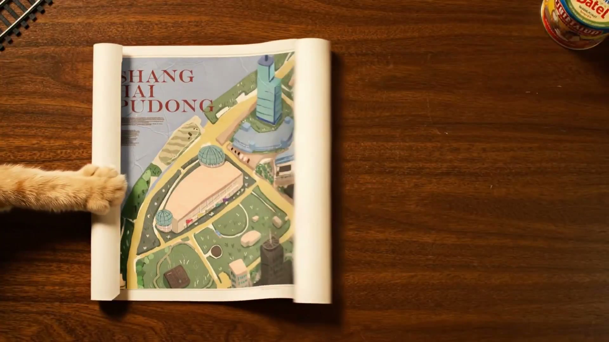 |

#### 场景2: 乘车抵达（03.0–07.5）

| # | 时间码 | 时长 | 景别 | 运镜 | 构图 | 色调+场景 | 角色 | 音效 | 叙事功能 | 特效 | 分镜图 |
|---|--------|------|------|------|------|----------|------|------|----------|------|--------|
| 2 | 03.0–07.5 | 4.5s | 中景 | 固定（窗外动态模糊） | 对称居中/猫背坐座椅 | 座椅暖黄#D4A017 / 窗外天空蓝#87CEEB | 橘猫（坐火车看窗外陆家嘴） | 火车轰鸣+广播"Welcome to Shanghai Pudong" | 抵达+天际线首次展示 | — | 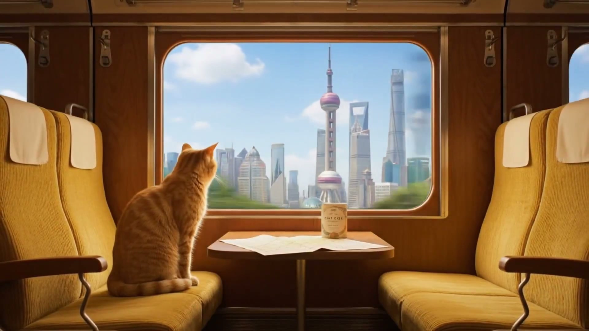 |

#### 场景3: 漫步外滩（08.0–13.5）

| # | 时间码 | 时长 | 景别 | 运镜 | 构图 | 色调+场景 | 角色 | 音效 | 叙事功能 | 特效 | 分镜图 |
|---|--------|------|------|------|------|----------|------|------|----------|------|--------|
| 3 | 08.0–10.5 | 2.5s | 远景 | 固定 | ★俯视/棋盘格+东方明珠投影（★地面无文字） | 淡黄#FDF9D2 / 淡绿#A8E4A0 / 淡蓝#ADD8E6 | 橘猫（棋盘格上朝前行走） | 轻快钢琴 | 趣味地标展示 | 东方明珠投影合成 | 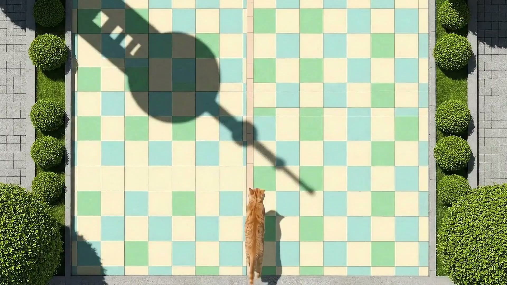 |
| 4 | 11.0–13.5 | 2.5s | 侧面中景 | 横移（跟猫） | 猫在前景栏杆走/★外滩新古典建筑群+东方明珠背景 | 天空青蓝#7EE2E0 | 橘猫（栏杆上漫步） | 猫爪轻触声 | 城市建筑美学 | — | 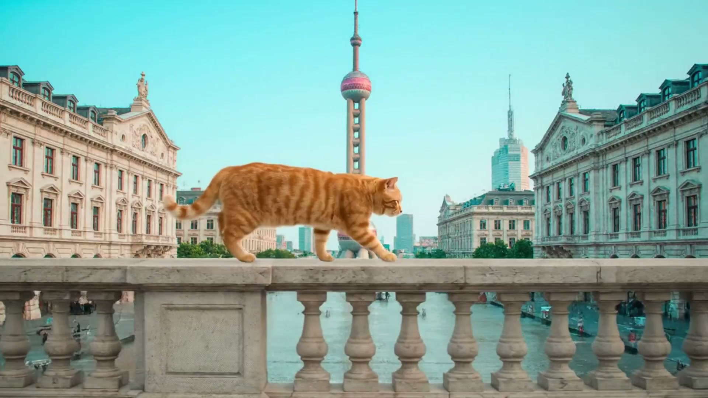 |

#### 场景4: 电梯登高（14.0–18.5）

| # | 时间码 | 时长 | 景别 | 运镜 | 构图 | 色调+场景 | 角色 | 音效 | 叙事功能 | 特效 | 分镜图 |
|---|--------|------|------|------|------|----------|------|------|----------|------|--------|
| 5 | 14.0–15.5 | 1.5s | 大特写 | 固定 | ★猫正面直视镜头/电梯厅（非电梯内，右侧有呼梯按钮） | 墨绿墙面#1A3C26~#2E4D34 / 铜金壁灯 | 橘猫（表情严肃好奇） | 电梯上升嗡嗡声 | 空间转换·仪式感 | — | 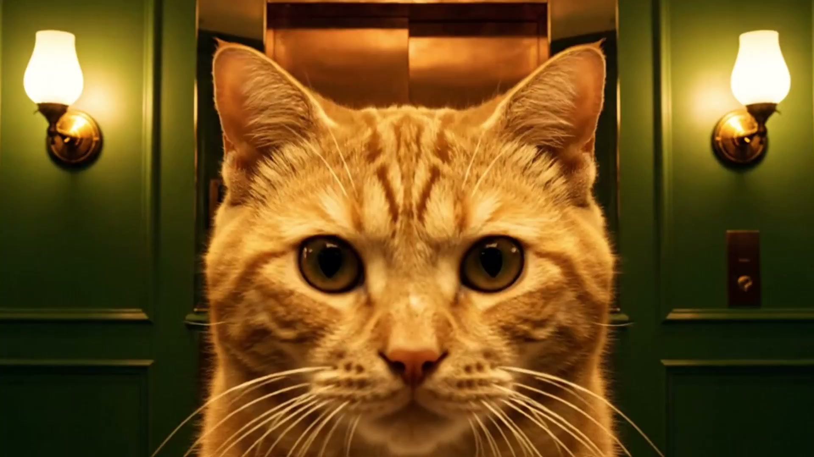 |
| 6 | 16.0–18.5 | 2.5s | 背影中景 | 固定 | ★猫坐圆形软垫凳/电梯门正中半开 | 室内绿#1A3C15 / 室外明亮蓝+青绿建筑 | 橘猫（坐等高凳看电梯门开） | 电梯"叮"到达声 | 空间转换·登高望远 | — | 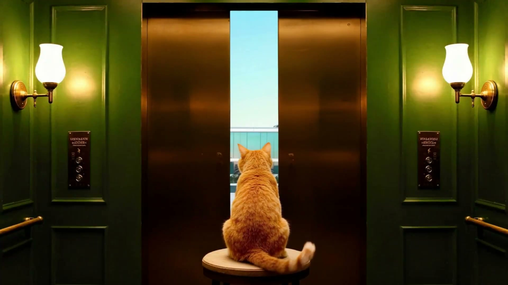 |

#### 场景5: 画中世界（19.0–22.5）

| # | 时间码 | 时长 | 景别 | 运镜 | 构图 | 色调+场景 | 角色 | 音效 | 叙事功能 | 特效 | 分镜图 |
|---|--------|------|------|------|------|----------|------|------|----------|------|--------|
| 7 | 19.0–22.5 | 3.5s | 全景 | 固定 | 金色雕花画框/中轴对称咖啡馆 | 橄榄绿墙面#6B703D / 画框古铜金#A68059 / 场景青绿#7BC4C4 | 橘猫（画中空地行走）+微缩人物（喝咖啡社交） | 环境人声+杯碰撞 | 艺术化城市生活 | 画作动画化（AI） | 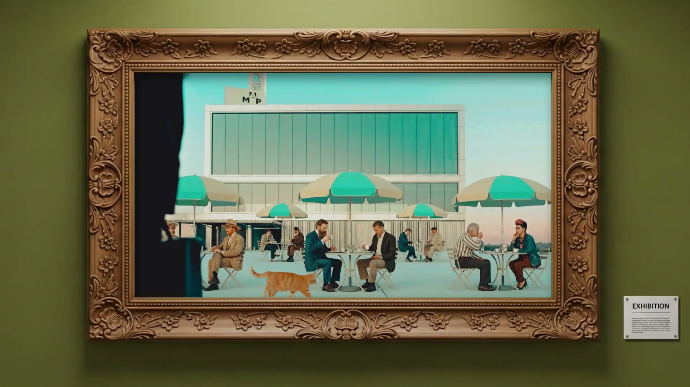 |

#### 场景6: 建筑巡礼（23.0–27.9）

| # | 时间码 | 时长 | 景别 | 运镜 | 构图 | 色调+场景 | 角色 | 音效 | 叙事功能 | 特效 | 分镜图 |
|---|--------|------|------|------|------|----------|------|------|----------|------|--------|
| 8 | ★23.0–24.5 | 1.5s | 主观视角 | 向前推进 | 猫耳后脑勺前景/★上海迪士尼奇幻童话城堡（非透明走廊） | 城堡青绿顶+粉白墙 / 天空青蓝#5BC2C1 | 橘猫（坐/被抱眺望城堡） | — | ★童话地标展示 | — | 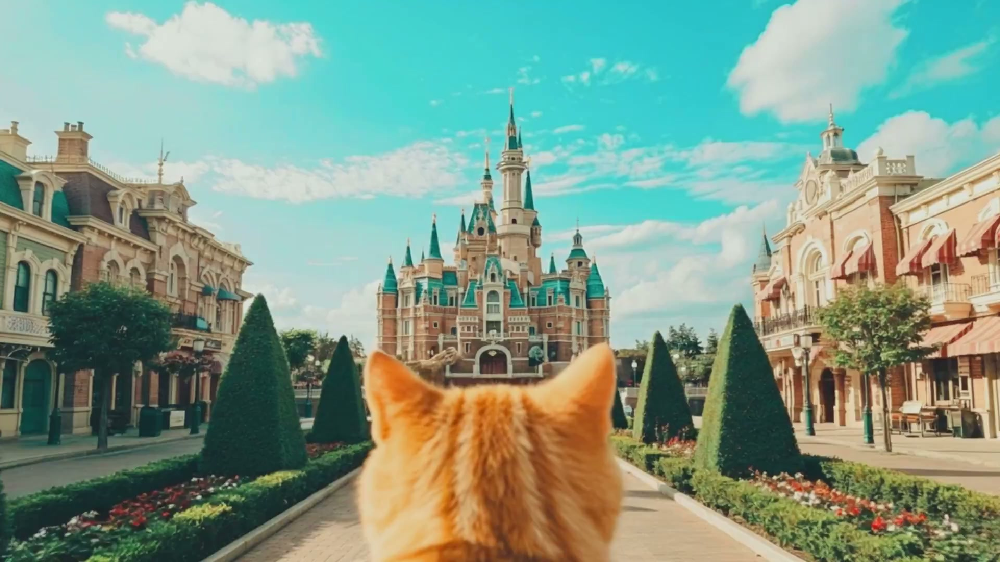 |
| 9 | ★25.0–26.5 | 1.5s | 全景 | 固定 | 猫背影居中/★上海天文馆（三体结构：倒穹顶+球幕影院，非梅赛德斯中心） | 天空青蓝#40E0D0~#00CED1 / 建筑银灰 | 橘猫（坐/蹲眺望天文馆） | — | ★科技地标展示 | — | 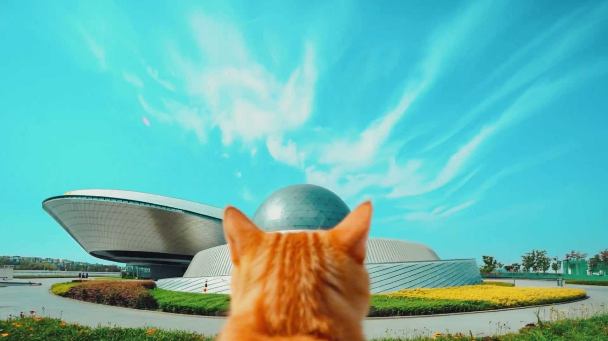 |
| 10 | ★27.0–27.9 | 0.9s | 中景 | 固定 | 嵌套画框/★猫悬挂彩色降落伞+Art Deco塔楼背景（非中华艺术宫） | 伞面红/黄/蓝三原色 / 建筑砂岩#C5B8A5 / 天空蓝 | 橘猫（★挂降落伞漂浮，非站立） | — | ★超现实地标巡礼 | 降落伞动画+框式嵌套 | 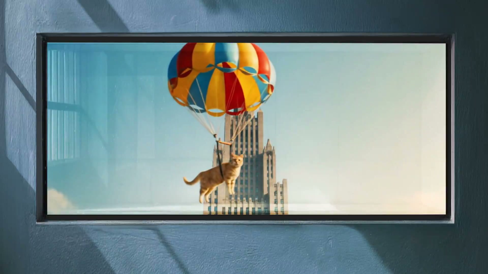 |

#### 场景7: 交通文明（28.0–34.5）

| # | 时间码 | 时长 | 景别 | 运镜 | 构图 | 色调+场景 | 角色 | 音效 | 叙事功能 | 特效 | 分镜图 |
|---|--------|------|------|------|------|----------|------|------|----------|------|--------|
| 11 | 28.0–30.5 | 2.5s | 中景 | 固定 | ★猫蹲坐路边/橙色轿车高速驶过（动态模糊）/微缩模型质感 | 车橙#FF8C00 / 天空青蓝#48D1CC / 树绿#228B22 | 橘猫（路边蹲坐看车） | 引擎声+刹车声 | 秩序·等 | — | 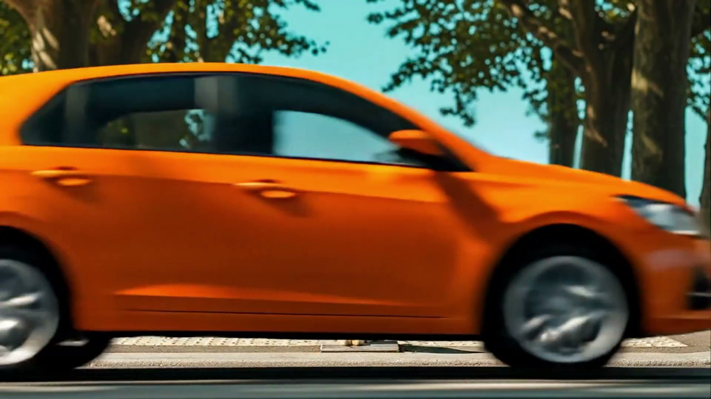 |
| 12 | 31.0–32.5 | 1.5s | ★分屏 | 固定 | L:像素猫形红绿灯（红灯·坐姿猫剪影）/ R:橘猫正面特写眨眼 | 信号柱灰绿#2D433D / 天空青蓝 | 橘猫（眨眼） | 红绿灯提示音 | 秩序·看+等 | 猫形红绿灯动画 | 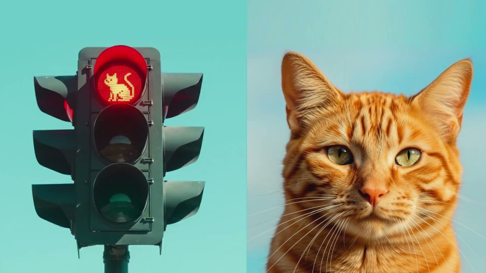 |
| 13 | 33.0–34.5 | 1.5s | 全景 | 固定 | ★俯视/猫走斑马线中轴/4车停放右侧（薄荷绿面包车+青绿+明黄+粉轿车）/东方明珠大阴影 | 斑马白#E8E9E4 / 路面灰#54585B | 橘猫（走斑马线） | — | 秩序·行 | — | 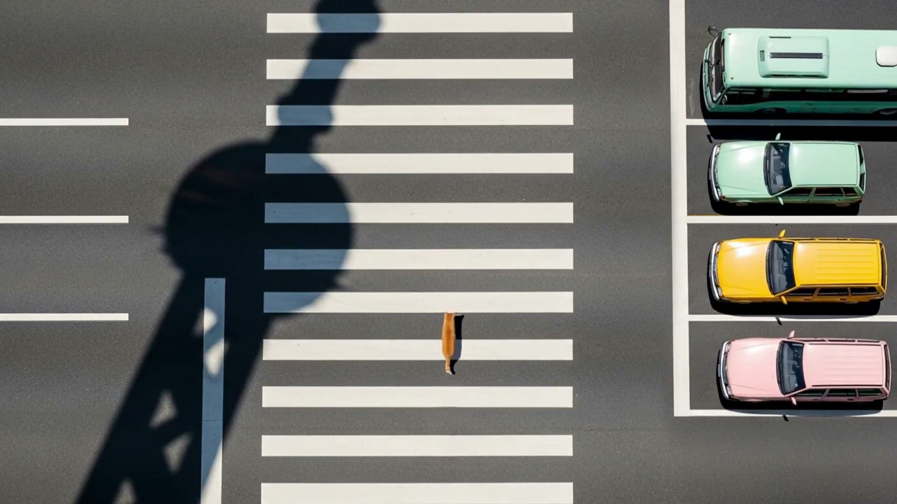 |

#### 场景8: 宠物友好与美食（35.0–41.9）

| # | 时间码 | 时长 | 景别 | 运镜 | 构图 | 色调+场景 | 角色 | 音效 | 叙事功能 | 特效 | 分镜图 |
|---|--------|------|------|------|------|----------|------|------|----------|------|--------|
| 14 | 35.0–35.9 | 0.9s | 特写 | 固定 | 对称双开门/猫头黄铜把手/挂牌居中 | 深绿门#1A5235 / 黄铜金 / 木牌浅棕 | — | 门铃 | 品牌触点·宠物友好 | — | 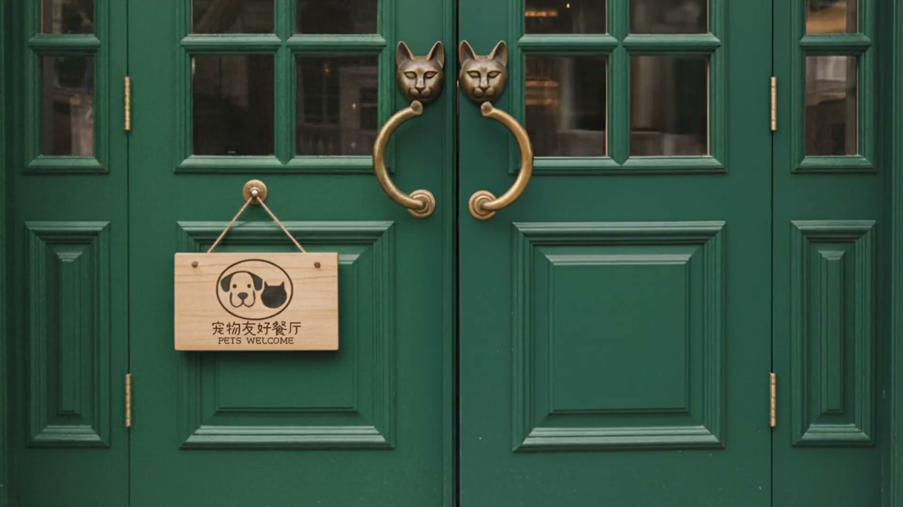 |
| 15 | 36.0–37.5 | 1.5s | 中景 | 固定 | 猫端坐正中/人手递拿铁拉花咖啡 | 薄荷绿#88C4C0 / 猫橘#E68A4F | 橘猫（端坐看咖啡）+人手（递咖啡） | — | 文明用餐 | — | 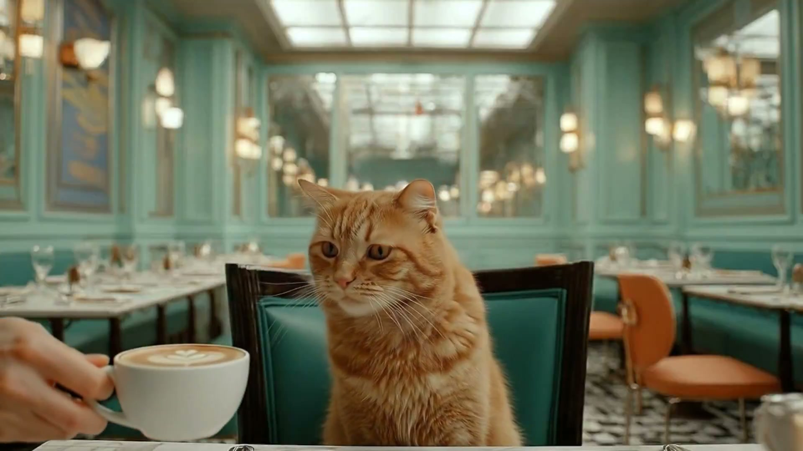 |
| 16 | ★38.0–40.5 | 2.5s | ★特写 | 固定 | ★单帧全俯视（非四分屏）——红烧肉+卤蛋+两碗米饭+木质筷子+蓝白筷架 | 红烧肉#8B2323 / 米饭#F5F5F5 / 桌布橙红#C04848 / 米黄#E5D3B3 | — | — | 多元美食展示 | — | 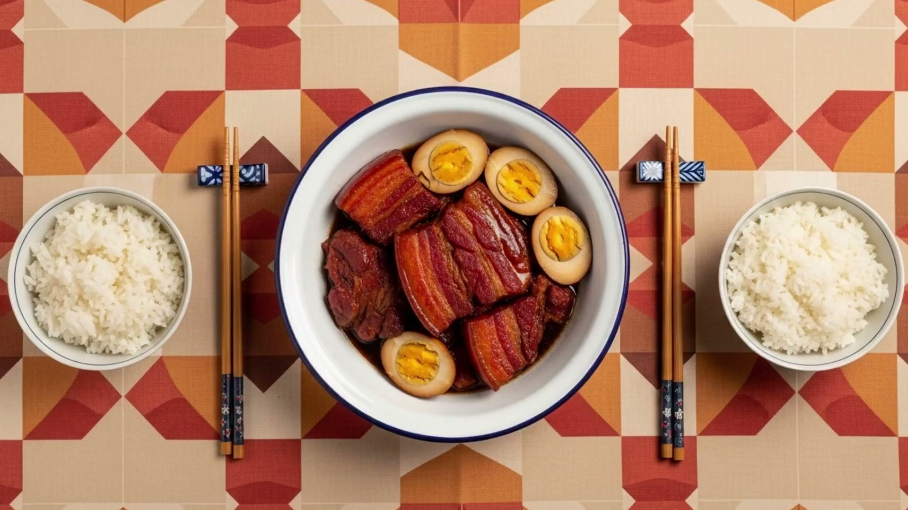 |
| 17 | 41.0–41.9 | 0.9s | 特写 | 固定 | 猫闭眼用白色纸巾擦嘴 | 薄荷绿背景 / 猫橘 | 橘猫（纸巾擦嘴·闭眼陶醉） | 擦拭声 | 文明礼仪 | — | 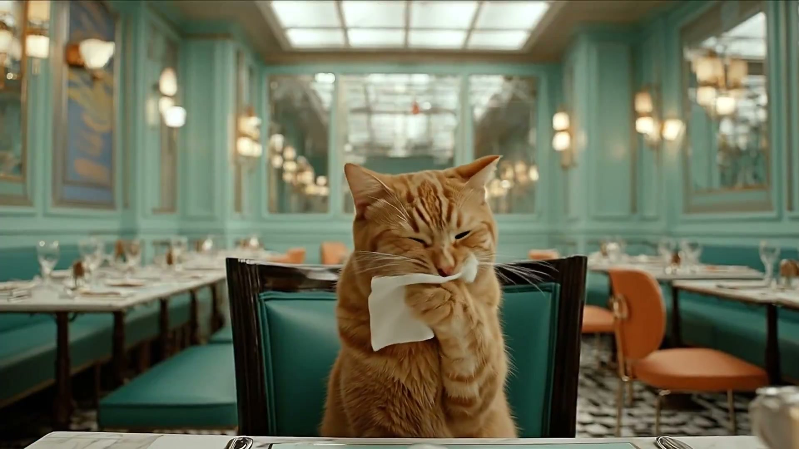 |

#### 场景9: 环保与自然（42.0–47.5）

| # | 时间码 | 时长 | 景别 | 运镜 | 构图 | 色调+场景 | 角色 | 音效 | 叙事功能 | 特效 | 分镜图 |
|---|--------|------|------|------|------|----------|------|------|----------|------|--------|
| 18 | 42.0–42.9 | 0.9s | ★分屏 | 固定 | 四分屏×3有效：猫爪投垃圾→灰桶（其他）/蓝桶（塑料瓶）/红桶（灯泡）; 右下黑屏 | 灰#808080 / 可回收蓝#4169E1 / 有害红#FF4500 | 橘猫（猫爪投垃圾） | "咚"声 | 垃圾分类 | — | 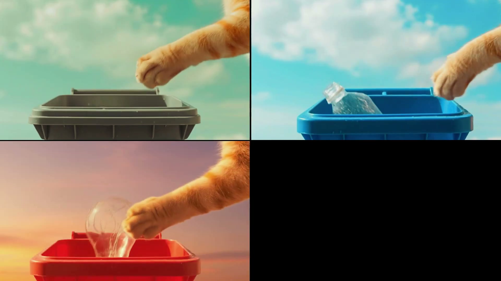 |
| 19 | 43.0–44.5 | 1.5s | ★分屏 | 固定 | L:★猫爪按压蒲公英（非吹）+种子飘散 / R:陆家嘴天际线+东方明珠（★无飞鸟） | L暖砖红#C14B2C / R天蓝#5FC2C7 | 橘猫（按压蒲公英） | — | 生态·自然 | 蒲公英粒子飘散 | 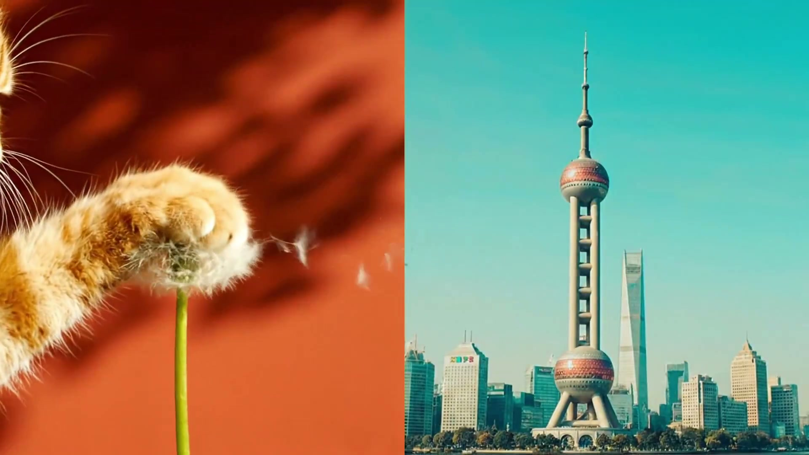 |
| 20 | 45.0–47.5 | 2.5s | ★分屏 | 固定 | 1:1上下等分。上:针叶林+猫耳 / 下:东方明珠球体（★猫耳从中缝冒出=球体变猫头错觉） | 上:深墨绿+青蓝天 / 下:东方明珠金属网格+红玻璃 | 橘猫（★猫耳从中缝冒出） | — | 生态·共生 | 图形匹配剪辑（Match Cut） | 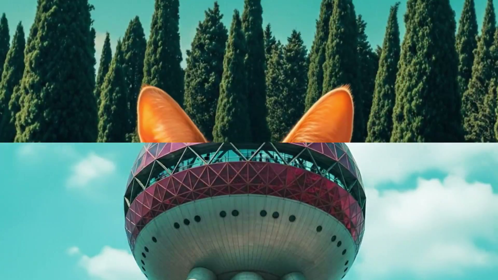 |

#### 场景10: 城市脉络（48.0–51.5）

| # | 时间码 | 时长 | 景别 | 运镜 | 构图 | 色调+场景 | 角色 | 音效 | 叙事功能 | 特效 | 分镜图 |
|---|--------|------|------|------|------|----------|------|------|----------|------|--------|
| 21 | 48.0–49.5 | 1.5s | ★分屏 | 固定 | L:绿毛线球+线头延伸 / R:★地铁2号线线路图（明确标注Line 2）+绿线=列车 | L黄#FFD700 / 绿#8BC34A / R米#E8E0D0 | — | — | 建设·脉络 | 毛线→列车视觉隐喻 | 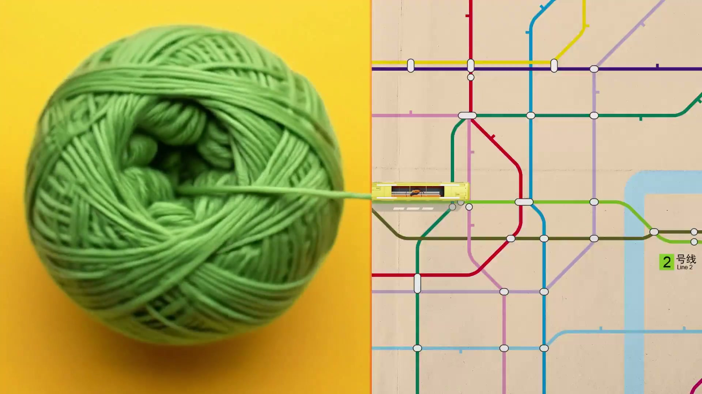 |
| 22 | 50.0–51.5 | 1.5s | ★分屏 | 固定 | 1:1上下。上:猫爪踩奶（★白玉兰花纹布料）/ 下:人手揉白面团+竹蒸笼 | 上:蓝底白玉兰#B0C4DE / 下:粉红底板#FFB6C1+面团白 | 橘猫（踩奶）＋人手（揉面） | — | 生活·烟火气 | 踩奶↔揉面视觉类比 | 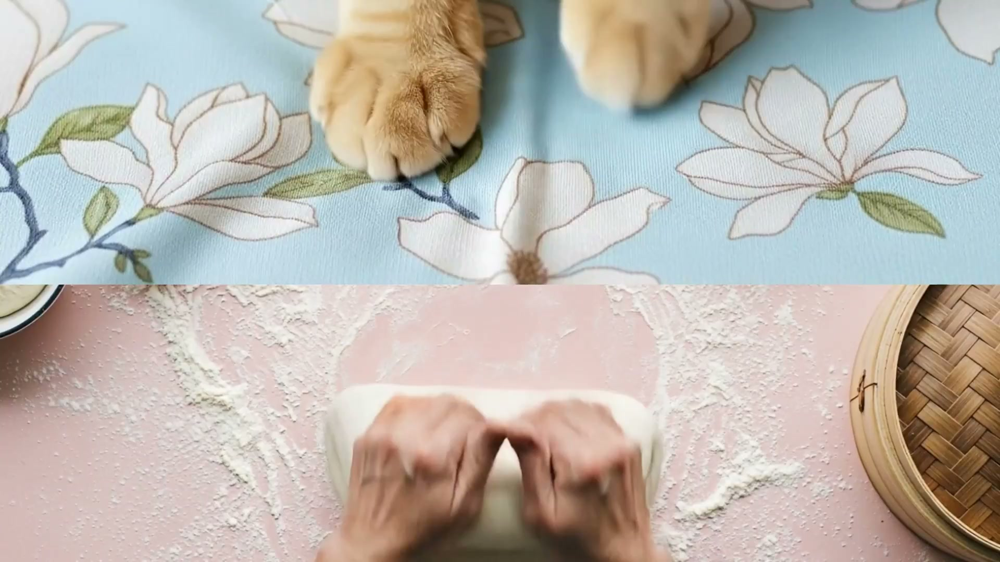 |

#### 场景11: 烟花庆典（52.0–56.5）

| # | 时间码 | 时长 | 景别 | 运镜 | 构图 | 色调+场景 | 角色 | 音效 | 叙事功能 | 特效 | 分镜图 |
|---|--------|------|------|------|------|----------|------|------|----------|------|--------|
| 23 | 52.0–56.5 | 4.5s | 远景 | 固定 | ★猫背影坐玻璃网格平台/陆家嘴夜景（东方明珠+上海中心） | ★夜空深蓝#050A15（冷调主导，非暖色高潮）/ 左金#FFD700+右银烟花 | 橘猫（坐看烟花→起身离场） | 烟花爆炸+欢呼 | ★情感收束（冷调庄重非暖色庆典） | 烟花粒子（菊花状+喷泉状） | 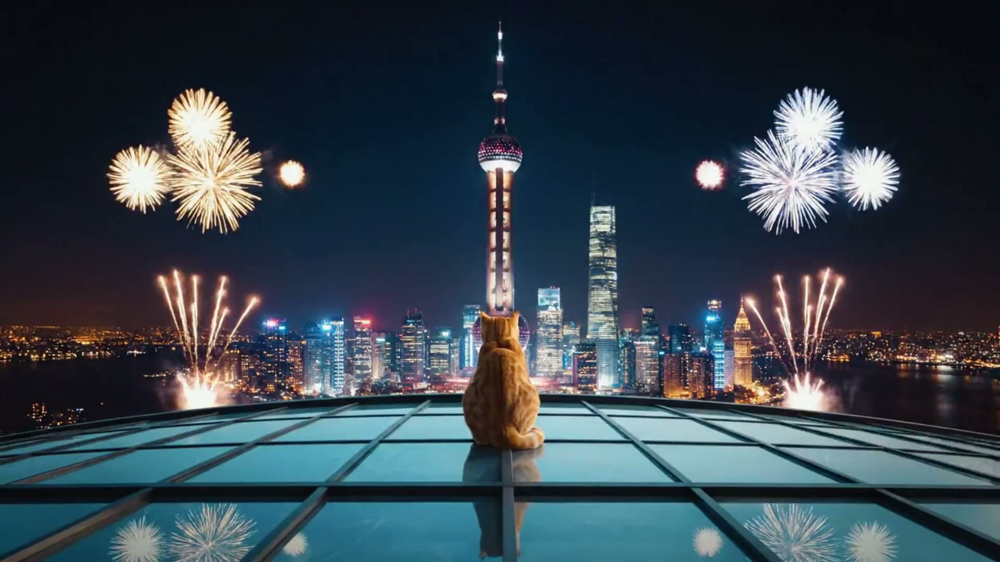 |

#### 场景12: 品牌背书（57.0–59.9）

| # | 时间码 | 时长 | 景别 | 运镜 | 构图 | 色调+场景 | 角色 | 音效 | 叙事功能 | 特效 | 分镜图 |
|---|--------|------|------|------|------|----------|------|------|----------|------|--------|
| 24 | 57.0–59.9 | 2.9s | — | 固定 | 左右对称双Logo：左"文明浦东 因你精彩"（红#A61B2E）+右"新时代文明实践中心"（蓝#0077AA） | 纯白#FFFFFF | — | — | 品牌确认·信息清零 | — |  |

#### 场景13: 片尾彩蛋（01:00–01:20）

| # | 时间码 | 时长 | 景别 | 运镜 | 构图 | 色调+场景 | 角色 | 音效 | 叙事功能 | 特效 | 分镜图 |
|---|--------|------|------|------|------|----------|------|------|----------|------|--------|
| 25 | 01:00–01:04 | ~4s | ★超近特写 | 固定 | ★双圆孔/望远镜视角——实为猫眼虹膜纹理（木纹错觉） | 暖棕+纯黑#000000 | — | — | 视觉趣味·错觉 | 微观摄影错觉 | 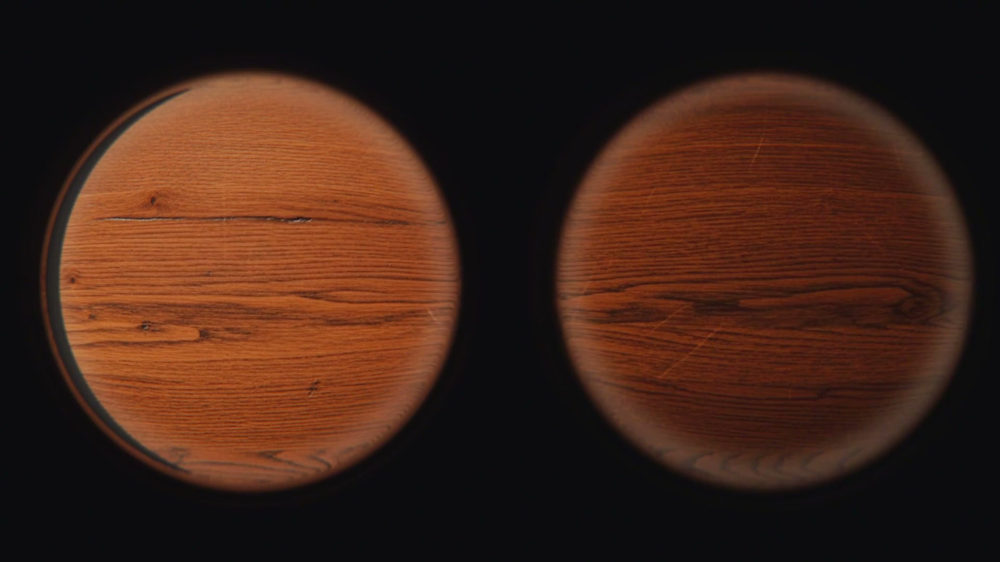 |
| 26 | 01:05–01:10 | ~5s | — | — | 地铁老人整齐排列/猫从中穿过 | — | 橘猫+老人群 | 采访"来上海还习惯吗" | 趣味彩蛋 | — | 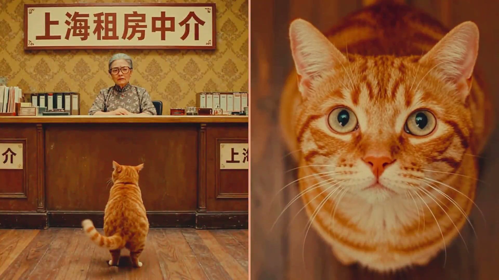 |
| 27 | 01:16 | ~1s | 中景 | 固定 | ★猫坐边境牧羊犬背上（非头上）/猫叼双绳牵两只柯基/背景拱桥+滨江步道 | 天空青蓝+狗黑白/柯基黄白 | 橘猫+边牧×1+柯基×2 | — | 视觉冲击·趣味高潮 | — | 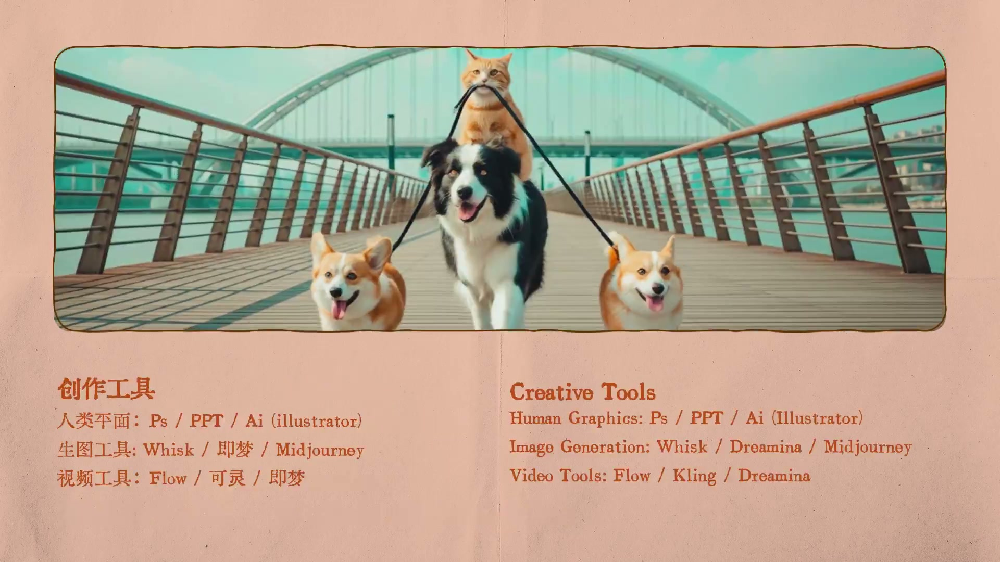 |
| 28 | 01:18 | ~2s | 中景 | 固定 | ★猫叼白色信封跑向镜头/城市步行街+行道树+Slogan | 底淡粉橘#E8C5B8 / 文字砖红#B35336 | 橘猫（叼信奔跑） | — | Slogan "文明浦东，等你来" | 文字叠加 | 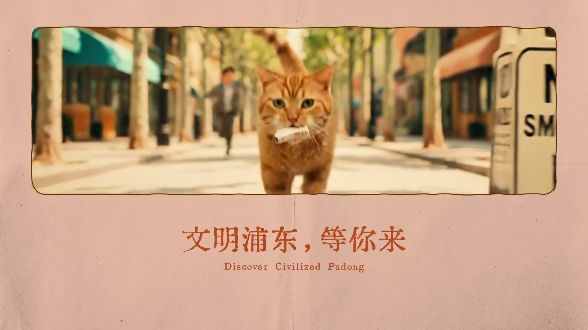 |

---

### 叙事节奏（→ Writer）

**全片节奏曲线**：慢起（2.5s 地图建立）→ 稳步推进（4.5s 火车抵达）→ 加速巡礼（0.9-2.5s 地标快速切换）→ 中速叙事（交通/美食/环保 1.5-2.5s）→ 渐慢沉浸（烟花4.5s 收束）→ 快收（Logo 2.9s + 彩蛋）

| 场景 | 镜头数 | 总时长 | 平均时长 | 节奏特征 |
|------|:---:|------|------|------|
| 1 · 开场 | 1 | 2.5s | 2.50s | 慢起，给观众识别地图+建立世界观的缓冲 |
| 2 · 乘车抵达 | 1 | 4.5s | 4.50s | 最慢单镜头，建立"外来者抵达"的情绪沉浸 |
| 3 · 漫步外滩 | 2 | 5.0s | 2.50s | 中速，地面棋盘格→栏杆漫步=视角切换 |
| 4 · 电梯登高 | 2 | 4.0s | 2.00s | 仪式感慢推——正面凝视→背影开门 |
| 5 · 画中世界 | 1 | 3.5s | 3.50s | 慢，让观众阅读画框内丰富细节 |
| 6 · 建筑巡礼 | 3 | 3.9s | 1.30s | ★最快，地标三连切（迪士尼→天文馆→降落伞塔） |
| 7 · 交通文明 | 3 | 5.5s | 1.83s | 中速，等→看→行的三拍节奏 |
| 8 · 宠物友好与美食 | 4 | 5.8s | 1.45s | 快速切换，门→餐厅→食物→擦嘴=完整行为链 |
| 9 · 环保与自然 | 3 | 4.9s | 1.63s | 中速，分类→自然→共生=递进 |
| 10 · 城市脉络 | 2 | 3.0s | 1.50s | 快，两组视觉隐喻并列 |
| 11 · 烟花庆典 | 1 | 4.5s | 4.50s | 最慢，全片情感停驻+收束 |
| 12 · 品牌背书 | 1 | 2.9s | 2.90s | 中慢，信息清零+品牌确认 |
| 13 · 彩蛋 | 4+ | ~20s | — | 快节奏趣味集锦+创作工具揭示 |

**叙事功能分布**：
- 引入世界观（镜头1–2）→ 城市巡礼（镜头3–10）→ 文明行为展示（镜头11–22）→ 情感收束（镜头23）→ 品牌确认（镜头24）→ 趣味彩蛋+幕后（镜头25–28）
- 文明理念递进：交通→宠物友好→美食多元→环保→城市脉络，每个主题2-4镜头，不给观众任何单一主题的疲劳时间
- 无对白/无旁白推进叙事——靠橘猫行为链+分屏并列+音乐节拍驱动。唯一人声：开场广播"Welcome to Shanghai Pudong"（接入）+彩蛋采访"来上海还习惯吗"（趣味收尾）
- 品牌信息通过两个触点释放：镜头14 "宠物友好餐厅"挂牌（中段·软植入）+ 镜头24 双Logo白底（结尾·硬确认）。镜头28 Slogan"文明浦东，等你来"=第三次也是最后一次品牌露出

**转场**：全片硬切为主。框式转场：画框（镜头7）、电梯门（镜头6）、嵌套画框（镜头10）。分屏不是转场而是并列叙事工具。

---

### 镜头语言序列（→ DP）

**运镜分布**：21/24 固定机位（87.5%），1 横移/跟拍（镜头4），1 向前推进（镜头8），1 无运镜（镜头24 Logo）。全片无摇移/升降/变焦推拉/旋转/手持——韦斯·安德森平面化运镜的严格执行。

**景别分布**：
- 特写/大特写 6（镜头1/5/14/16/17/25）—— 细节凝视+行为特写
- 中景 9（镜头2/4/6/10/11/15/21/22/28）—— 叙事推进主力
- 全景/远景 7（镜头3/7/8/9/12/13/23）—— 空间建立+情感驻留
- 主观视角 1（镜头8 猫耳POV）—— 沉浸代入
- 分屏 6（镜头12/18/19/20/21/22）—— 不占传统景别，信息并列

**构图模式**：
- 绝对对称/单主体居中：18/24（75%）—— 韦斯·安德森核心特征
- 俯视（Top-down）：4（镜头1/3/13/16）—— 桌面/棋盘格/斑马线/美食="上帝视角"的秩序感
- 分屏并列：6（镜头12/18/19/20/21/22）—— "并列=关联"的叙事工具
- 画框嵌套：2（镜头7/10）—— 展示"被观看"的浦东

**镜头时长序列**（按场景）：2.5→4.5→5.0→4.0→3.5→3.9→5.5→5.8→4.9→3.0→4.5→2.9→~20
- 最短单镜：镜头10/14/18（0.9s，快速识别）
- 最长单镜：镜头2（4.5s，火车沉浸）+ 镜头23（4.5s，烟花停驻）

**焦距与灯光**：
- 全AI生成画面，无物理焦距——但视觉等效：微距/浅景深（镜头1/16/17 桌面+食物特写），中焦（镜头2/4/6/15 中景叙事），广角等效（镜头3/8/9/23 全景+远景）
- 灯光：全片高调柔和光，阴影浅→童话感。色温锁定5500K日光为主，仅镜头23转深蓝夜+烟花暖光点缀

**重复曝光**：东方明珠出现6次——镜头2窗外/镜头3阴影/镜头4背景/镜头19右屏/镜头20下屏（球体）/镜头23夜景。每次角度+光线+功能不同（远景识别→投影趣味→地标背景→分屏并列→视觉错觉→夜景收束）。

---

### 色调+场景搭建序列（→ Art Director）

| 场景 | 主色(hex) | 辅色(hex) | 色温 | 光源方向 | 核心道具 | 视觉重心 | 空间布局 |
|------|-----------|-----------|------|---------|---------|---------|---------|
| 1·开场 | 木纹棕#5D3A1A | 米杏#E8D5B5+橄榄绿#8DA36D | 5500K | 顶光柔和 | 卷轴地图+猫罐头 | 猫爪+地图中心 | 桌面/全俯视 |
| 2·乘车 | 座椅黄#D4A017 | 天空蓝#87CEEB | 5500K | 侧窗自然光 | 小木桌+地图+罐子 | 猫背影中轴 | 对称车厢 |
| 3·外滩 | 淡黄#FDF9D2/淡绿#A8E4A0/淡蓝#ADD8E6 | — | 5500K | 日光漫射 | 棋盘格地面+东方明珠投影 | 猫背影+投影 | 棋盘格广场/俯视 |
| 4·电梯 | 墨绿#1A3C26 | 铜金壁灯 | 3200K暖 | 两侧壁灯对称 | 金属电梯门+呼梯按钮+圆凳 | 猫脸正面(5)→猫背(6) | 电梯厅/对称走廊 |
| 5·画中 | 橄榄绿#6B703D | 古铜金#A68059+青绿#7BC4C4 | 5500K | 画面内日光 | 金色画框+咖啡桌椅+遮阳伞 | 猫在画中行走 | 画框嵌套/展览厅 |
| 6·建筑巡礼 | 青蓝#5BC2C1 | 城堡粉白+降落伞三原色 | 5500K | 日光 | 迪士尼城堡+上海天文馆+彩色降落伞 | 猫背影在地标前 | 城堡广场/天文馆/塔楼空 |
| 7·交通 | 橙#FF8C00/青#48D1CC | 斑马白#E8E9E4 | 5500K | 日光 | 猫形红绿灯+斑马线+彩色小车 | 猫+信号灯+斑马线 | 街道/微缩模型 |
| 8·宠物友好 | 薄荷绿#88C4C0 | 深绿门#1A5235+红烧肉#8B2323 | 5500K | 室内柔光 | 猫头把手+拿铁咖啡+白纸巾 | 猫端坐+人手 | 餐厅/对称 |
| 9·环保自然 | 砖红#C14B2C/天蓝#5FC2C7 | 垃圾桶彩+东方明珠 | 5500K | 日光/逆光 | 蒲公英+分屏垃圾桶+针叶林 | 猫爪+地标 | 分屏并列 |
| 10·脉络 | 黄#FFD700/绿#8BC34A | 蓝底白玉兰#B0C4DE+粉#FFB6C1 | 5500K | 柔光 | 毛线球+地铁图+布料+面团 | 猫爪+人手 | 分屏 |
| 11·烟花 | ★夜空蓝#050A15 | 金#FFD700+银烟花+城市暖灯 | — | 烟花自发光+城市灯光 | 烟花+玻璃网格平台 | 猫背影+烟花 | 高空平台/全景 |
| 12·Logo | 纯白#FFFFFF | 红#A61B2E+蓝#0077AA | — | 平面光 | 双Logo | Logo居中 | 平面白底 |
| 13·彩蛋 | 暖棕→淡粉橘#E8C5B8 | 青蓝天空+狗黑白/橘 | 5500K | 日光 | 猫眼/信封/狗+牵引绳 | 猫眼错觉+猫骑狗+猫叼信 | 街道/桥/滨江 |

**色温变化曲线**：5500K（1-10）→ 夜景深蓝（11）→ 纯白平面（12）→ 5500K回归（13）。全片95%+保持日光一致色温——仅镜头23例外。★冷色调主导全片（马卡龙青蓝+薄荷绿=70%+），暖色为点缀（猫橘+中国红+烟花金）。

**光源方向演进**：柔和顶光（桌面）→ 侧窗自然光（火车）→ 日光漫射（外滩/巡礼）→ 壁灯对称暖光（电梯）→ 室内柔光（餐厅）→ 烟花自发光（夜景）→ 平面白光（Logo）。全片无戏剧性硬光/逆光——柔和均匀光=文明=秩序。

**材质还原要点**：AI生成材质的"微不完美"（毛发边缘轻微闪烁/建筑纹理重复/物理规律微妙偏移）被保留为风格特征。木纹桌面#5D3A1A有年轮纹理+铁轨金属反光；猫毛橘色虎斑"M"额头纹清晰；黄铜把手高光反射自然；针叶林轮廓锐利vs东方明珠球体金属网格的几何精度。

**色彩策略**：韦斯·安德森马卡龙色谱为底座（薄荷绿/复古橙/芥末黄/天蓝/肉粉），地标标志色忠实保留（东方明珠银灰+红玻璃/天文馆银灰/城堡粉白）。不同AI工具的色彩差异通过全局色温锁定5500K+饱和度压缩统一。全片无纯黑阴影——暗部提亮保留"玩具屋"呼吸感。

---

### 角色设计序列（→ Writer + Art Director + DP + Sound）

> 本片核心角色=橘猫（唯一推动叙事的主体）。无对白/无旁白/无具名人类角色。微缩人物作为"城市居民"群体出现，承担氛围营造功能。

| 镜头 | 角色出现 | 行为 | 视觉特征 | 声音线索 |
|------|---------|------|---------|---------|
| 1 | 橘猫 | 猫爪拨开/按压地图 | 橘色虎斑"M"额纹+粉鼻 | 纸张摩擦 |
| 2 | 橘猫 | 坐火车背对镜头看窗外 | 背影·坐姿·尾巴盘绕 | 火车轰鸣 |
| 3 | 橘猫 | 棋盘格上前行 | 背影·行走姿态 | 钢琴 |
| 4 | 橘猫 | 石栏杆上漫步 | 侧面·动态步态 | 猫爪轻触 |
| 5 | 橘猫 | 正面直视镜头·表情严肃 | 大特写·黄绿眼·虎斑纹理 | 电梯嗡嗡 |
| 6 | 橘猫 | 坐圆凳背影·等电梯门开 | 背影·坐姿 | 电梯叮 |
| 7 | 橘猫+微缩人群 | 猫画中行走+人群喝咖啡社交 | 猫漫步·人群复古西装礼帽 | 环境人声 |
| 8 | 橘猫 | 眺望城堡 | 背影·猫耳竖立 | — |
| 9 | 橘猫 | 坐/蹲眺望天文馆 | 背影 | — |
| 10 | 橘猫 | ★挂降落伞漂浮 | 四肢自然下垂·尾巴上翘 | — |
| 11 | 橘猫 | 路边蹲坐看车过 | 正面蹲坐·冷静 | 引擎刹车 |
| 12 | 橘猫 | 正面特写·眨眼 | 头部特写·胡须清晰 | 红绿灯提示音 |
| 13 | 橘猫 | 走斑马线 | 背影·行走 | — |
| 15 | 橘猫+人手 | 猫端坐·人手递咖啡 | 端坐·严肃·看咖啡 | — |
| 17 | 橘猫 | 闭眼用纸巾擦嘴 | 陶醉·纸巾遮半脸 | 擦拭声 |
| 18 | 橘猫 | 猫爪投垃圾 | 猫爪伸向垃圾桶 | 咚声 |
| 19 | 橘猫 | ★猫爪按压蒲公英（非吹） | 爪垫按压·种子飘散 | — |
| 20 | 橘猫 | ★猫耳从中缝冒出（=球体变猫头） | 猫耳+针叶林+球体 | — |
| 22 | 橘猫+人手 | 猫爪踩奶+人手揉面 | 猫爪毛绒+人手动态模糊 | — |
| 23 | 橘猫 | 坐玻璃平台看烟花→起身离场 | 背影·坐→起 | 烟花欢呼 |
| 25 | ★猫眼（非租房面试） | 猫眼超近特写·虹膜纹理 | 木纹错觉·双圆孔 | — |
| 26 | 橘猫+老人群 | 猫从老人间穿过 | 猫行走+老人整齐坐 | 采访人声 |
| 27 | 橘猫+边牧+2柯基 | ★猫坐边牧背叼双绳牵柯基 | 猫橘/边牧黑白/柯基黄白 | — |
| 28 | 橘猫 | 叼信封奔跑 | 口叼白色信封·面向镜头跑 | — |

**角色功能总结**：橘猫=文明浦东的"代言人"——它不说不教不命令，只"做"（看地图/坐火车/等红灯/吃美食/分类垃圾/吹蒲公英/看烟花）。观众通过猫的"无意识文明行为"完成自我说服——"连猫都做到了"。微缩人群=城市背景居民，提供"活的城市"氛围但不抢猫的主角地位。全片唯一非猫主角=镜头27三只狗（制造视觉惊喜+社交传播记忆点）。

---

### 音效序列（→ Sound）

> ⚠️ 帧抽图无法验证声音，以下基于 video_analyze 两遍交叉验证。标注置信度。

| 场景 | 时间码 | 音效 | 类型 | 层次(dB) | 置信度 |
|------|--------|------|------|---------|:---:|
| 1 | 00:00 | 纸张展开摩擦声 | Foley | 前景 +3~6 | 中 |
| 1 | 00:00起 | 轻快法式小调/室内乐（木琴+钢琴+弦乐） | 音乐 | 主层 -6 | 高 |
| 2 | 00:03 | 火车行驶轰鸣 | Foley | 前景 +3 | 中 |
| 2 | 00:03 | "Welcome to Shanghai Pudong"英文广播（女声·车厢混响0.5-0.8s） | 人声 | 中层 -10 | 高 |
| 3 | 00:08 | 猫爪轻触棋盘格地面 | Foley | 近层 -12 | 中 |
| 4 | 00:11 | 猫爪划过石栏杆 | Foley | 近层 -12 | 中 |
| 5 | 00:14 | 电梯上升嗡嗡声 | Foley | 中远层 -18 | 中 |
| 6 | 00:16 | 电梯到达"叮"声（★落在音乐强拍上） | Foley | 前景 | 中 |
| 7 | 00:19 | 环境人声+咖啡杯碰撞 | 环境音 | 远层 -24 | 低 |
| 11 | 00:28 | 汽车引擎+刹车 | Foley | 前景 | 中 |
| 12 | 00:31 | 红绿灯提示音（★落在音乐off-beat上） | Foley | 前景 | 中 |
| 14 | 00:35 | 门铃/开门 | Foley | 前景 | 低 |
| 17 | 00:41 | 纸巾擦拭声 | Foley | 近层 -12 | 中 |
| 18 | 00:42 | 垃圾入桶"咚"声×3（★四声各占4分音符） | Foley | 前景 | 中 |
| 23 | 00:52 | 烟花爆炸（低频boom+高频crackle）+人群欢呼 | 庆典音效 | 全频段 | 中 |
| 26 | 01:05 | 采访"来上海还习惯吗" | 人声 | 中层 -10 | 中 |

**声音层次架构**：
- 音乐：~50%，法式小调/室内乐（木琴+小提琴拨弦+单簧管），120-130 BPM波尔卡/华尔兹速度。全程覆盖无静默
- 拟音（Foley）：~35%，混音前景（+3~6dB），每个猫的动作有清晰听觉反馈——用"人造音效"翻译猫行为（猫爪触地=轻皮鞋跟tap、擦嘴=布料摩擦、按键=轻触）
- 环境音：~10%，远层-20~-24dB，仅咖啡座人声
- 人声层：~5%，仅两处——开场广播（接入仪式感）+彩蛋采访（趣味收尾）。其余79秒零人声
- 无旁白层

**剪辑-音乐同步**：配乐作为节拍器——镜头切换点落在节拍格上（误差<100ms）。场景切换与音乐小节边界对齐。音乐节奏120-130BPM → 大多数镜头在1-2个小节（2-4s）时节奏最舒适。

---

### 特效序列（→ VFX）

| 场景 | 镜头 | 特效 | 类型 | 关键技术挑战 |
|------|:---:|------|------|------|
| 1 | 3 | 东方明珠投影（棋盘格地面） | 光影合成 | 阴影形状+透视精度 |
| 1 | 7 | 画作动画化（画框内世界） | AI生成+画框嵌套 | 画内世界与画框边界匹配 |
| 1 | 10 | ★彩色降落伞+猫悬挂 | AI生成+框式嵌套 | 降落伞物理+猫与伞的比例匹配 |
| 1 | 11-13 | 微缩模型城市场景（车辆/斑马线/建筑比例） | AI生成+超现实尺度 | 猫与人类世界尺度的自然匹配 |
| 1 | 12 | ★像素猫形红绿灯动画 | 2D像素动画 | 猫形剪影在红绿灯中的像素化呈现 |
| 1 | 16 | ★（单帧全俯视·非分屏） | AI生成 | 食物材质还原（红烧肉油光/米饭颗粒） |
| 1 | 19 | 蒲公英种子飘散 | 粒子/2D | 种子飘散方向+速度自然 |
| 1 | 20 | ★图形匹配剪辑（Match Cut）——猫耳位置=东方明珠球体顶部错觉 | 剪辑+合成 | 两个异构画面的精确对位 |
| 1 | 21 | 毛线→地铁列车视觉隐喻 | 2D合成 | 绿色毛线无缝过渡为地铁2号线绿线列车 |
| 1 | 22 | 踩奶↔揉面视觉类比 | 分屏并列 | 猫爪与人手动作的节奏匹配 |
| 1 | 23 | 烟花粒子（菊花状+喷泉状） | 粒子系统 | 烟花色彩（金vs银）的冷暖对比 |
| 1 | 25 | ★猫眼虹膜→木纹视觉错觉 | 微观摄影 | 虹膜纹理读取为木材纹理的双关错觉 |
| 1 | 28 | Slogan文字叠加 | 2D文字 | 砖红#B35336字体+位置与画面色调融合 |

**特效密度曲线**：场景1-2（轻特效·1要素）→ 场景3-6（中特效·AI地标合成）→ 场景7-10（中高特效·分屏+视觉隐喻）→ 场景11（重特效·烟花粒子+夜景）→ 场景12-13（轻特效·Logo+文字）。

**全片最密集特效时刻**：镜头23烟花（多层粒子：菊花状高空+喷泉状中低空） + 镜头20 Match Cut + 镜头21毛线→列车隐喻。

**AI生成管线推测**：多工具混合——静态/对称镜头（任意AI工具均可）→猫特写（动物渲染优先工具，可能是Kling或Midjourney+视频化）→动态镜头（运动平滑优先，可能是Runway或可灵）→后期DaVinci Resolve统一色彩（全局色温5500K+饱和度压缩+暗部提亮）。

---

### 分镜精选帧

> 存储路径：`assets/PUDONG-CAT/frame_*.jpg`（28张，覆盖全部镜头）
> 消费方式：DP（构图参考）→ 取景类似 frame_01（俯视）或 frame_06（对称）；Art Director（色谱采样）→ frame_15（薄荷绿+橘）或 frame_23（深蓝+金）；Storyboard（image_gen reference）→ 构图像 frame_12（分屏猫形红绿灯）或 frame_20（Match Cut）

| # | 对应镜头 | 时间码 | 技法要点 | 路径 |
|---|:---:|--------|---------|------|
| 1 | 1 | 00:01.0 | 开场俯视·猫爪地图·木纹桌面材质（AD色板：木棕#5D3A1A） | assets/PUDONG-CAT/frame_01_map.jpg |
| 2 | 2 | 00:05.0 | 火车对称构图·猫背+东方明珠窗外（DP对称参考） | assets/PUDONG-CAT/frame_02_train.jpg |
| 3 | 3 | 00:09.0 | 棋盘格+东方明珠大阴影·俯视=秩序（AD:马卡龙三色盘） | assets/PUDONG-CAT/frame_03_chess.jpg |
| 4 | 4 | 00:12.0 | 猫栏杆行走+外滩建筑·横移跟拍（DP运动镜头参考） | assets/PUDONG-CAT/frame_04_railing.jpg |
| 5 | 5 | 00:15.0 | 电梯厅·猫正面凝视·墨绿#1A3C26（AD复古绿基准） | assets/PUDONG-CAT/frame_05_elevator_face.jpg |
| 6 | 6 | 00:17.0 | 电梯门半开·猫坐圆凳背影·绝对对称（DP构图圣经） | assets/PUDONG-CAT/frame_06_elevator_door.jpg |
| 7 | 7 | 00:21.0 | 画框嵌套·猫行走·古铜金#A68059（创意策略核心帧） | assets/PUDONG-CAT/frame_07_painting.jpg |
| 8 | 8 | 00:24.0 | ★迪士尼城堡·POV视角·猫耳前景（DP主观镜头参考） | assets/PUDONG-CAT/frame_08_corridor.jpg |
| 9 | 9 | 00:26.0 | ★上海天文馆·三体结构·猫背影（地标=科技=浦东DNA） | assets/PUDONG-CAT/frame_09_mercedes.jpg |
| 10 | 10 | 00:27.5 | ★降落伞猫+Art Deco塔楼（超现实尺度匹配参考） | assets/PUDONG-CAT/frame_10_china_art.jpg |
| 11 | 11 | 00:29.0 | 猫路边蹲坐+橙色车运动模糊·微缩质感（DP动静对比） | assets/PUDONG-CAT/frame_11_roadside.jpg |
| 12 | 12 | 00:31.5 | ★分屏·猫形红绿灯（红灯）+猫眨眼特写（VFX像素动画参考） | assets/PUDONG-CAT/frame_12_traffic_light.jpg |
| 13 | 13 | 00:34.0 | 俯视斑马线+4色车停放+东方明珠阴影（AD俯视秩序） | assets/PUDONG-CAT/frame_13_crosswalk.jpg |
| 14 | 14 | 00:35.5 | 猫头黄铜把手+宠物友好挂牌·深绿门#1A5235（品牌触点参考） | assets/PUDONG-CAT/frame_14_pet_door.jpg |
| 15 | 15 | 00:37.0 | 猫端坐+人手递拿铁·薄荷绿#88C4C0+猫橘#E68A4F（AD核心色谱） | assets/PUDONG-CAT/frame_15_restaurant.jpg |
| 16 | 16 | 00:39.0 | ★单帧全俯视·红烧肉+米饭双人餐（AD食物材质参考） | assets/PUDONG-CAT/frame_16_quad_food.jpg |
| 17 | 17 | 00:41.5 | 猫闭眼纸巾擦嘴·陶醉表情（Writer角色行为参考） | assets/PUDONG-CAT/frame_17_wipe_mouth.jpg |
| 18 | 18 | 00:42.5 | ★三分屏垃圾分类·灰蓝红桶（创意策略：行为=信息） | assets/PUDONG-CAT/frame_18_trash_sort.jpg |
| 19 | 19 | 00:44.0 | ★分屏·猫爪按压蒲公英+陆家嘴（VFX粒子飘散+无飞鸟） | assets/PUDONG-CAT/frame_19_dandelion.jpg |
| 20 | 20 | 00:46.0 | ★Match Cut·猫耳=球体猫头错觉（剪辑/VFX对位精度参考） | assets/PUDONG-CAT/frame_20_cat_ear_forest.jpg |
| 21 | 21 | 00:49.0 | ★毛线→2号线列车隐喻（VFX跨媒介合成参考） | assets/PUDONG-CAT/frame_21_yarn_metro.jpg |
| 22 | 22 | 00:51.0 | ★踩奶↔揉面类比·白玉兰布料（VFX视觉类比参考） | assets/PUDONG-CAT/frame_22_knead_dough.jpg |
| 23 | 23 | 00:54.0 | ★烟花+猫背影·深蓝#050A15+金#FFD700（AD夜景色谱：冷调主导） | assets/PUDONG-CAT/frame_23_fireworks.jpg |
| 24 | 24 | 00:58.0 | 双Logo白底·红#A61B2E+蓝#0077AA（品牌视觉参考） | assets/PUDONG-CAT/frame_24_logo.jpg |
| 25 | 25 | 01:02.0 | ★猫眼虹膜·双圆孔错觉（创意视觉双关参考） | assets/PUDONG-CAT/frame_25_rent_interview.jpg |
| 26 | 26 | 01:07.0 | 老人地铁·猫穿行（场景搭建群体角色参考） | assets/PUDONG-CAT/frame_26_metro_elder.jpg |
| 27 | 27 | 01:16.0 | ★猫骑边牧牵柯基·桥背景（传播记忆点·趣味高潮） | assets/PUDONG-CAT/frame_27_dog_stack.jpg |
| 28 | 28 | 01:18.5 | 猫叼信奔跑+Slogan"文明浦东，等你来"（品牌收束参考） | assets/PUDONG-CAT/frame_28_run_letter.jpg |

---

### 消费映射速查

| 角色 | 激活阶段 | 读拉片层 | 分镜图用途 |
|------|:---:|------|------|
| Writer | P2/P4 | §叙事节奏（时长分布/功能标记/节奏曲线）+ §角色设计序列 | 叙事转折帧（frame_02抵达→frame_07画中世界→frame_23烟花收束） |
| DP | P4 | §镜头语言序列（景别/运镜/构图/焦距/灯光）+ §角色设计序列 | 俯视参考（frame_01/13）、对称参考（frame_06/15）、运动参考（frame_04）、POV参考（frame_08） |
| Art Director | P3 | §色调+场景搭建序列（色调/光源/空间/道具/视觉重心/材质/色温）+ §角色设计序列 | 色谱核心帧（frame_05墨绿#1A3C26、frame_15薄荷绿#88C4C0+橘#E68A4F、frame_23深蓝#050A15+金#FFD700）；材质参考（frame_01木纹、frame_14黄铜）；马卡龙全色盘（frame_03三色+frame_21黄绿+frame_22蓝粉） |
| Sound Designer | P5 | §音效序列（触发点/类型/层次）+ §角色设计序列 | 间接——时长分布推节奏密度 + 角色出场推声音时机；BPM=120-130（波尔卡/华尔兹） |
| VFX | P6 | §特效序列（类型/时机/关键技术/密度曲线） | 核心VFX帧：frame_12（猫形像素动画）、frame_20（Match Cut对位）、frame_21（毛线→列车隐喻）、frame_23（烟花多层粒子）、frame_25（猫眼错觉） |
| Storyboard | P6 | 全量 + 分镜图 | image_gen composition reference——首选 frame_12（分屏构图）、frame_06（对称中轴）、frame_13（俯视城市）、frame_15（Wes Anderson室内） |

